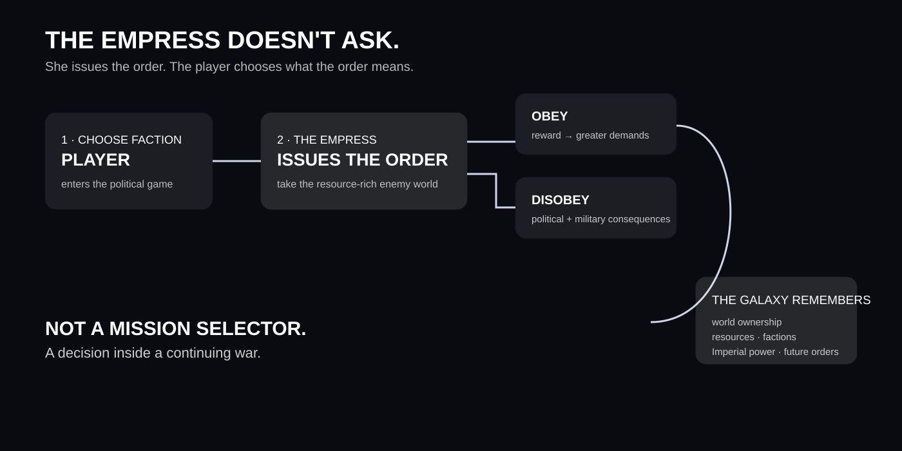
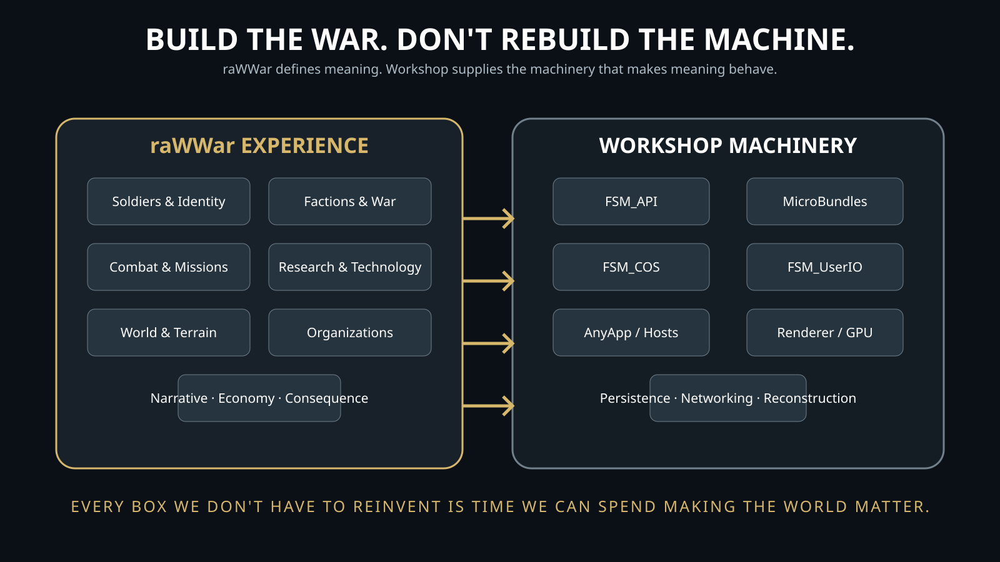
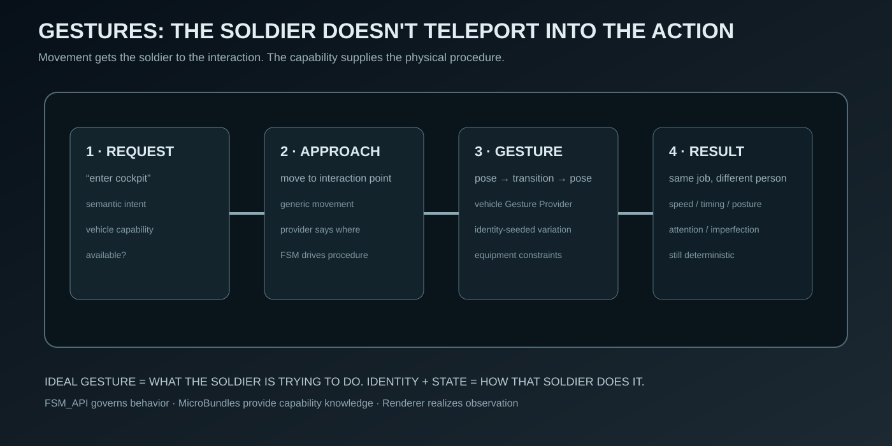

# raWWar

> **The soldiers themselves are the stars of this game.**

**raWWar is an Experience, not an application.** It is a first-person war in which the world continues to live whether the player is looking at it or not.

The player does not select a character and watch a simulation happen around them. **The player inhabits a soldier inside a living military system.** That soldier has an identity, qualifications, relationships, responsibilities, equipment, opportunities, history, and consequences.

The question is not simply *“What mission do I play?”*

It is:

> **What happens when I become one of the people who has to live here?**

---

## See the intent first

A launch crew can be working while another squad trains, researchers run experiments, logistics moves material, command reviews the situation, and soldiers spend their downtime together.

That is the target.

**The world should always be doing something.**

Where the player looks, there should be evidence of systems, people, procedures, decisions, work, failure, recovery, and consequence.

---

## One galaxy. Not a stack of maps

The raWWar universe is a **galaxy**. The Empire spans many star systems, and the campaign is a continuous war rather than a sequence of disposable maps.

Warp drives exist, but a jump takes **days to initialize and prepare**. Distance, logistics, reinforcement, and time therefore matter.

After choosing a faction, the player is introduced to the Empress. She orders the player to take a poorly defended but resource-rich enemy world and uphold the tithe. She does not wait for an answer.

The player can obey or disobey. Obedience earns rewards and increasingly egregious demands. Disobedience changes the player's relationship with Imperial authority. Either way, **the player's actions affect the Empire and the larger galaxy.**

> **This is not “pick a sector and play a map.” This is living inside the war.**

## What kind of Experience is this?

raWWar is always first-person, but the role the player inhabits can grow dramatically.

- **Soldier** — qualify, serve, fight, repair, research, build, explore, survive.
- **Officer** — lead people, make decisions, manage pressure, command operations.
- **Cooperative** — share a war with other players whose interests and objectives may differ.
- **Multiplayer** — fight FFA, team-vs-team, or persistent conflicts.
- **Persistent Universes** — enter a universe whose history continues without you.

A player may operate a weapon system, repair an aircraft, crew a launch pad, conduct research, construct infrastructure, fly a vehicle, command a formation, investigate intelligence, socialize, gamble, train, teach, or simply march with their unit.

These are not separate games.

**They are different ways of inhabiting the same war.**

A raWWar soldier is not a class selected from a menu. Identity, qualification, responsibility, reputation, relationships, equipment, and history accumulate over time.

---

## Why this repository is different

raWWar is being designed as an **Experience manifested by the Singularity Workshop**, rather than as a conventional engine-bound application.

raWWar owns the things that make **raWWar** raWWar:

- soldiers and identity;
- factions and military organizations;
- qualifications and careers;
- equipment and vehicles;
- combat and missions;
- research and technology;
- construction and infrastructure;
- terrain, weather, and world history;
- economics and social life;
- narrative and consequence.

The Workshop provides reusable machinery so raWWar does **not** have to reinvent the same infrastructure:

- FSM behavior through **FSM_API**;
- composable capabilities through **MicroBundles**;
- composition through **FSM_COS**;
- semantic user interaction through **FSM_UserIO**;
- hosting and manifestation through **AnyApp** and other hosts;
- observer-relative presentation through the **Workshop Renderer**;
- persistence, networking, reconstruction, and related infrastructure as those capabilities mature.

**We want to spend our time making the world matter—not rebuilding the machinery underneath every world.**

---

## The repository is a design instrument

This repository is not a pile of feature promises.

It is where raWWar becomes sufficiently clear that the next thing can actually be built.

The design documents deliberately distinguish:

- **Canon** — established design.
- **Candidate** — a direction under consideration.
- **Experiment** — something to prove through implementation.
- **Illumination Needed** — a question that still requires the creator's vision.

When something is not defined, we do not quietly invent it and call the invention design.

### Start here

- [Game Design Document](docs/GAME_DESIGN_DOCUMENT.md) — the living master design.
- [Game Design Bible](docs/GAME_DESIGN_BIBLE.md) — foundational principles and world rules.
- [Experience Architecture](docs/EXPERIENCE_ARCHITECTURE.md) — how raWWar fits into the Workshop.
- [Design Hub](docs/DESIGN_HUB.md) — the intended public visual navigation model.
- [Vision and Pillars](docs/VISION_AND_PILLARS.md) — the core experience.
- [Gestures Design](docs/GESTURES_DESIGN.md) — physical soldier movement as data + FSM behavior.
- [Advisors and Command Staff](docs/ADVISORS_AND_STAFF.md) — qualified people, candidate records, specialist advice, and command appointments.
- [Renderer Integration](docs/RENDERER_INTEGRATION.md) — how the world becomes observable without making presentation the source of truth.

---

## Visual atlas

The [visual asset catalogue](docs/images/README.md) explains the diagrams and their intended use. The artwork is deliberately explanatory: it should make systems, dependencies, people, and consequences easier to understand—not merely decorate the repository.

## The design standard

A conventional game document tells you what features exist.

**This one should let you see the world.**

If a concept can be shown better than it can be described, we should show it.

That means:

- concept imagery;
- annotated scenes;
- system diagrams;
- relationship graphs;
- timelines;
- tables;
- charts and population visualizations;
- equipment and qualification progression;
- base and facility diagrams;
- terrain/data maps;
- Renderer captures;
- interactive demonstrations;
- technical deep dives for the machinery underneath.

The repository is therefore being built toward a public **design experience**, not merely a stack of Markdown files.

> **Make the design easier to see.**

---

## Development principle

We are going to discover raWWar before we fully build raWWar.

The creator's descriptions are primary source material. The repository organizes those ideas, exposes contradictions, identifies missing rules, and turns the resulting design into a deterministic Experience shape.

The old engine-specific project shell has been removed. raWWar is not defined by a particular game engine or display technology.

**AnyApp comes first. MyVR and other manifestations follow.**

---

## Persistence

The long-term vision includes persistent universes that begin from a common premise but develop independently.

Players can join an ongoing universe at any point. If they lose their position, they can potentially return as a new member of another faction.

Once actual storage, simulation, bandwidth, persistence, and usage costs are measured, the business vision is to return approximately 25% of raWWar revenue toward sustaining persistent universes.

A future concept under consideration is the existence of extremely difficult-to-find pocket dimensions that could allow rare crossings between otherwise separate universes. This remains **candidate design**, not canon.

---

**Make the soldiers matter. Make the war alive.**
