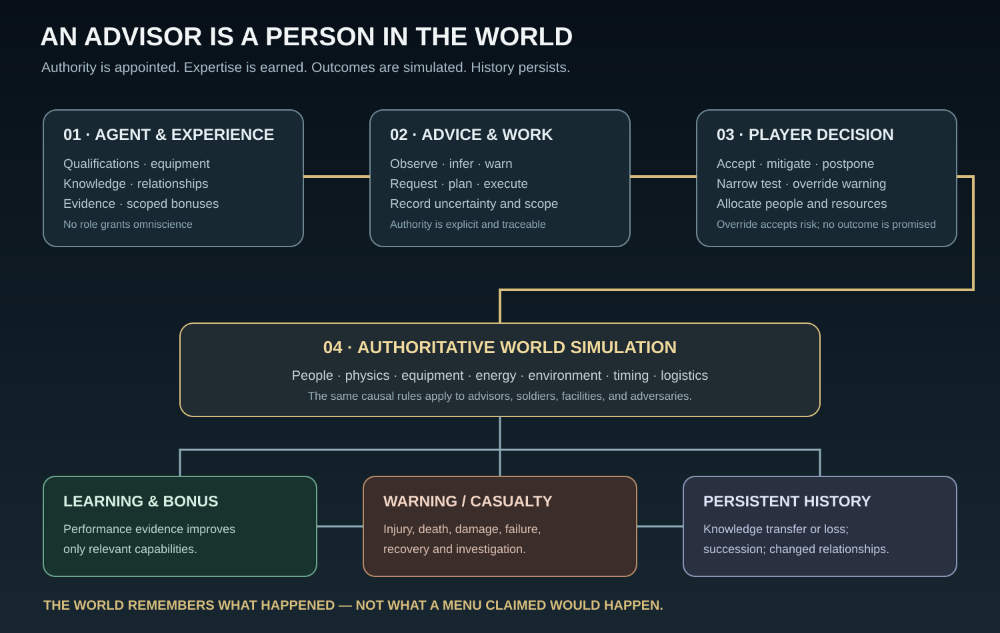
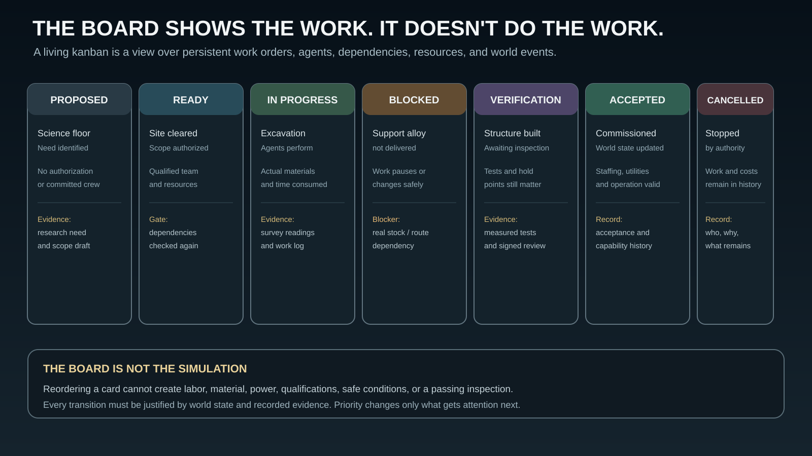

# raWWar — Advisor Agents, Consequences, and the Work Kanban

Status: Living design contract. The shared world simulation is authoritative; this document specifies desired behavior, not a claim that the full runtime already exists.

> **An advisor can be right, be ignored, do the work anyway, earn a reputation, and die because the work was too dangerous. The world must remember all of it.**

## 1. The advisor is an agent

An advisor is a living soldier or specialist in the same persistent world as the player. They have a physical presence and equipment, a personnel identity, a service and qualification history, needs and limitations, current assignments, relationships, knowledge, and their own FSM-driven agent behavior.

Appointment grants a role and an explicit authority scope. It does not replace the person's existing capabilities or manufacture expertise. The agent evaluates situations using available observations, reports, qualifications, experience, objectives, and constraints. It may recommend, request resources, initiate authorized work, warn of danger, negotiate priorities, disagree with another advisor, or revise a position when new evidence arrives.

Agents act through the same simulation rules as everyone else. They do not receive a secret outcome oracle and do not get to skip travel, work, logistics, access control, qualification, or physical risk.

## 2. Advisors can die

Death is a possible persistent world outcome, not a special advisor-menu state. An advisor may die in battle, in an accident or failed experiment, through an assassination, or because a player order knowingly accepts a risk that the advisor warned about. The simulation must determine whether the actual circumstances and physical actions produce a lethal outcome.

A science advisor may report that the underground science floor lacks an adequate containment boundary, power isolation, instrumentation, or a required acceptance test. The warning records the observations, inference, uncertainty, recommended mitigation, and affected work. The player may postpone the experiment, fund mitigation, narrow the test, or override the warning and order the work to proceed.

If the advisor is then killed by the resulting event, the world records a causal chain:

`observations → warning → player decision → authorized work → physical event → casualty → response and recovery`

The advisor can literally be reduced to a vaporized cloud of carbon dust if the authored materials, energy release, exposure, and physics model support that outcome. It must not be a predetermined cutscene triggered merely because the player clicked “proceed.”

The record must distinguish what the advisor knew, what they said, what the player was told, what the player ordered, what mitigation was accepted or rejected, and what the world did. A warning is evidence, not immunity. An override allows the player to accept risk; it does not guarantee either disaster or success.

### Death and succession

- The person's identity and history remain; their active life and assignments end.
- Their unfinished work is not silently completed. It is reviewed, blocked, reassigned, or continued by an authorized successor.
- Unique knowledge may be lost if it was never recorded, taught, or transferred.
- Personal bonuses do not automatically transfer to a replacement.
- Access credentials, classified holdings, keys, and delegated authority enter explicit revocation or custody procedures.
- Subordinates may grieve, lose confidence, change their behavior, or continue under established orders when those effects are supported by the relationship and agent models.
- Assassination is a hostile operation requiring an opportunity, means, and causal event; it is not a random button that deletes a staff slot.
- A casualty report, investigation, memorial, recovery work, and political or operational consequences become part of history when relevant.

A vacant essential appointment can pause work that depends on its authority. Delegates may preserve only the continuity responsibilities they were explicitly granted. The player must be able to recruit, promote, appoint, and qualify a successor; the successor inherits records and authorized access, not the dead person's lived experience.

## 3. Advisors earn bonuses through their own agents

The player can earn bonuses through experience, demonstrated performance, and development. Advisors use the same principle, but their progress is driven by their agents doing work in the world.

A bonus is a scoped, evidenced improvement—not a magical global multiplier. A pilot may become better at a particular flight-control task; a tank operator may become especially capable at damaged-vehicle recovery; a scientist may improve experimental method; a systems specialist may improve protocol analysis. The underlying agent accumulates experience by performing relevant work, receiving feedback, training, and learning from outcomes.

Each earned bonus should record:

- the person/agent who earned it;
- the domain and scope of the improvement;
- the evidence or experience events supporting it;
- its magnitude and uncertainty;
- conditions under which it applies;
- whether it can improve, decay through disuse, or be refreshed through recertification;
- what happens to it if the person dies, is incapacitated, or changes roles.

A bonus can improve execution or judgment within its scope. It cannot bypass physical prerequisites, replace required qualifications, create missing equipment, make a bad measurement valid, or guarantee success. Team-wide benefit requires an actual transfer mechanism—training, documentation, demonstration, shared practice, or direct coordination. Simply appointing an expert does not instantly make every soldier an expert.

Candidate records may show bonuses before appointment, allowing the player to consider what the person has already earned. Advisors can then continue earning new, relevant bonuses after appointment. Their career and performance history persist if they leave the staff.

## 4. Kanban is the player's operational view of real work

The kanban is a view of authoritative work orders and projects. It is not a decorative task manager, an independent simulation, or the source of truth for world state. Moving a card cannot teleport materials, create labor, satisfy a qualification, pass an inspection, or finish construction.

Suggested columns:

| Column | Meaning | Example |
|---|---|---|
| **Proposed** | A need or opportunity has been identified, but is not yet approved and resourced. | Science advisor proposes an underground laboratory floor. |
| **Ready** | Scope and authority are clear; prerequisites are currently satisfied. | Site survey accepted, design authorized, excavation team and materials committed. |
| **In progress** | Agents and resources are performing actual work. | Excavation, structural work, utility installation, equipment integration. |
| **Blocked** | A specific dependency prevents progress. | Required support alloy is missing, a feeder is unavailable, or a qualified inspector is absent. |
| **Verification** | Work awaits inspection, test, evidence review, or acceptance. | Structural hold point, power distribution test, lab commissioning. |
| **Accepted / done** | Completion criteria passed and resulting world state was committed. | Science floor accepted and operational staffing assigned. |
| **Cancelled** | An authorized cancellation was recorded. | Project abandoned; costs and work already performed remain in history. |

Cards are projections of persistent work items. A card should link to the actual owner agent, worksite, resources, qualifications, dependencies, risk assessment, progress evidence, completion criteria, and event history. Where useful, it can expose a physical view, a dependency graph, a schedule, or the relevant people—not just a status badge.

### Work item fields

At minimum, an executable work item needs stable identity, kind, title, owning agent, logical creation time, priority, status, prerequisites, required resources, required qualifications, location, risk assessment, progress evidence, completion criteria, and event history. Specialized work can add estimated duration, crew and shift requirements, access conditions, safety holds, material custody, acceptance criteria, or expected side effects.

### State changes must be earned

- Proposed → Ready requires authorization, an owner, a defined scope, and a prerequisite check.
- Ready → In progress requires committed resources, an available qualified agent, and a safe worksite.
- In progress → Blocked records the actual blocker.
- Blocked → Ready requires resolving the blocker and checking prerequisites again.
- In progress → Verification requires completion evidence.
- Verification → Accepted requires the appropriate inspection or acceptance to pass.
- Cancellation records who authorized it and what was already consumed, installed, damaged, or learned.

Priority is not capacity. Reordering a card changes what people are asked to work on; it does not create another crew, shorten physical curing or cooling time, deliver spare parts, or remove an interlock. Work-in-progress limits can be useful for organizations with finite supervisory capacity, but they must be explicit constraints rather than hidden UI behavior.

## 5. The kanban is also a command interface

The board should let the player understand what is happening and issue meaningful decisions:

- inspect a blocked project and its actual dependencies;
- authorize or reject a proposed project;
- assign a qualified owner or delegate authority;
- reprioritize work and see which other work is displaced;
- allocate scarce people, materials, facilities, power, or schedule windows;
- review warnings and evidence before authorizing a risky action;
- accept, reject, or require rework after verification;
- cancel work while seeing sunk cost and hazards from partial completion;
- trace any completed result back to the orders and physical events that produced it.

A card may aggregate hundreds of lower-level work orders. The player sees the appropriate level of detail for their current responsibility, while the underlying work remains decomposable into tasks performed by agents. Expanding a project should reveal real dependencies, not generate fictitious sub-tasks just to make the board look busy.

## 6. Advisors initiate work; they do not bypass the world

Appointment starts a work program. The military commander may initiate a command-structure assessment and force-readiness review. The science advisor can immediately propose and scope the science floor beneath headquarters, identify research prerequisites, and request a construction project. An aviation advisor can begin a flight-test risk review. A spymaster can organize collection priorities and counterintelligence work.

These first actions are candidate-specific and must be grounded in their qualifications, knowledge, authority, and circumstances. Work then follows the ordinary construction, research, logistics, personnel, power, security, maintenance, and acceptance rules.

For the science-floor example, the board may show separate linked work for survey, excavation, support structure, shell, utility corridors, power distribution, environmental controls, laboratory equipment, safety systems, staffing, commissioning, and acceptance. Dependencies can overlap where physically feasible; the system must not force an arbitrary single-file sequence. The facility becomes usable only when the necessary conditions have actually been met.

## 7. Implementation boundaries

The intended composition uses shared capabilities rather than one special implementation per advisor:

- **Personnel and qualification:** identity, service history, eligibility, training, and recertification.
- **Agent behavior:** goals, observations, decisions, warnings, learning, and delegated actions.
- **Appointment and authority:** positions, permissions, scopes, delegation, vacancy, and succession.
- **Experience and bonuses:** evidence-backed, scoped development.
- **Work item and dependency graph:** projects, tasks, blockers, ownership, and state transitions.
- **Risk and decision history:** warnings, acknowledged risks, orders, mitigations, outcomes, and casualties.
- **Physical world capabilities:** construction, research, combat, logistics, maintenance, security, and acceptance.
- **Presentation:** kanban boards, candidate dossiers, timelines, maps, and reports as views over world data.

These are candidate micro-bundle boundaries, not an instruction to make one bundle per file or UI panel. FSMs should drive discrete state transitions and procedures; continuous physical models remain explicit models. Work and death histories must not depend on the player keeping a screen open.

## 8. Data contracts added alongside this document

- [Advisor appointments](../data/advisor-appointments.json) — role authority, qualification groups, initial work programs, bonus domains, and succession intent.
- [Advisor candidates](../data/advisor-candidates.json) — illustrative candidate records, evidence, limitations, earned bonus examples, and warning behavior.
- [Work kanban contract](../data/work-kanban-contract.json) — columns, required work-item fields, legal transitions, risk overrides, death, and capacity rules.

These files are design seed data and contracts. They do not claim the full agent, kanban, death, or advisor runtime has already been implemented. Numerical bonus values are illustrative, not finalized balance.

## Design principle

> **The board shows the work. The agents do the work. The world decides what happens. History remembers why.**
