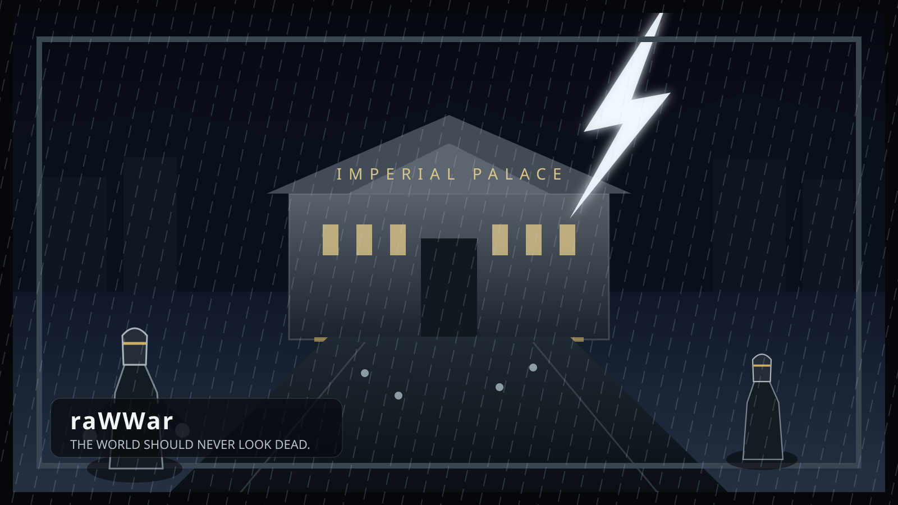
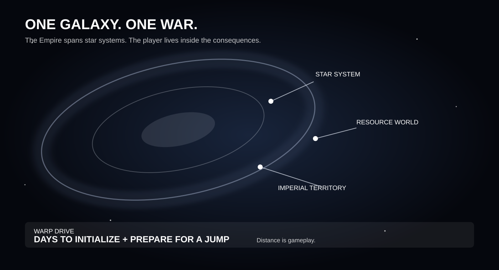

# raWWar — Public Design Hub

Status: Design for the future public WebPage presentation.

## Purpose

The raWWar design should eventually be presented as a living Workshop experience rather than as a single giant document.

The public presentation should allow a visitor to understand the game quickly, then descend into the machinery and design depth.

## Proposed navigation

### raWWar

The raWWar landing experience introduces the game visually and establishes the core proposition:

> **The soldiers themselves are the stars of this game.**

### Nested design hub

The raWWar design hub should expose:

- **Summary** — concise public explanation of the Experience.
- **Design Document** — the comprehensive master GDD.
- **Units** — soldiers, squads, formations, specialists, organizational roles.
- **Structures** — bases, buildings, facilities, launch pads, laboratories, barracks, command centers.
- **Gameplay** — what the player actually does.
- **Research** — scientific work and technology progression.
- **Combat** — ground, air, and space warfare.
- **Play Modes** — campaign, cooperative, competitive, persistent, massively persistent.
- **Factions** — political and military organizations.
- **Characters** — commanders, soldiers, researchers, and other important people.
- **Equipment** — exoskeletons, armor, weapons, tools, sensors, communications, modules.
- **Vehicles** — ground, air, orbital, and space vehicles.
- **Training** — qualifications, certifications, progression, officer development.
- **Economy** — pay, possessions, currency, ownership, recreation.
- **Terrain & Maps** — world geography, terrain generation, tactical and strategic maps.
- **World** — history, weather, environment, population, living systems.
- **Narrative** — story, factions, characters, environmental storytelling.
- **Audio** — music, sound, ambience, voice, environmental life.
- **Visual Design** — soldiers, equipment, vehicles, structures, environments, Gestures.
- **Technology** — FSM_API, FSM_COS, MicroBundles, Renderer, GPU computation, AnyApp.
- **Multiplayer** — cooperative, competitive, networking, synchronization.
- **Persistent Universes** — long-lived worlds, identity, history, economics, universe lifecycle.
- **Development** — current state, experiments, design gaps, milestones.

## Relationship to the master GDD

The master GDD is the comprehensive reading path.

The focused tabs are views into the same design knowledge.

They must not become independent competing sources of truth.

The intended model is:

**Master GDD → section → focused design view → deep-dive document**

For example:

**Design Document → Gestures → Gesture deep dive → authoring specification**

or:

**Design Document → Vehicles → vehicle design → individual vehicle MicroBundle**

## Design-gap behavior

A focused tab must never manufacture missing design.

If a subject is not sufficiently defined, the UI should say so clearly.

Example:

> **This part of raWWar has not been illuminated yet.**
>
> The current design establishes that terrain is important, but the actual world-generation vision has not yet been defined.
>
> **Questions waiting for the creator:** What does the world look like? How large is it? How much is procedural? What landmarks matter?

This turns missing design into an invitation to continue the Workshop process.

## Future presentation

The final presentation should be visual-first.

Where useful, a section can contain:

- diagrams;
- concept art;
- interactive models;
- system relationships;
- timelines;
- data relationships;
- simulation demonstrations;
- videos;
- interactive Renderer demonstrations;
- expandable technical explanations.

The visitor should be able to read at three depths:

1. **What is it?**
2. **How does it work in the game?**
3. **How does the Workshop technology make it possible?**

This preserves the Workshop principle:

> **Edify, not mystify.**

## Publishing concept

The public design hub should eventually be driven from the same design sources used to build the Experience.

The goal is not to manually maintain a public copy of the design.

Instead, the publishing pipeline should eventually transform structured design material into the WebPage presentation.

The exact publishing architecture remains open.

## Current state

This document is a presentation/design concept only.

No WebPage implementation is implied by this document.

## Experience Architecture

Expose [Experience Architecture](EXPERIENCE_ARCHITECTURE.md) as a dedicated deep dive showing what raWWar owns, what FSM_API/FSM_COS/MicroBundles/AnyApp/Renderer provide, what Event Horizons mean, and what the Experience deliberately does not reinvent.

The public presentation should use architecture diagrams, responsibility tables, scale visualizations, and interactive examples rather than implementation prose alone.

> **The game is the Experience. The machinery is the Workshop.**
