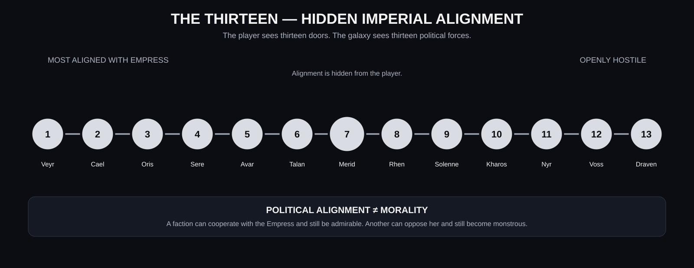

# raWWar — Public Design Hub

Status: Design for the future public WebPage presentation.

## Purpose

The raWWar design should eventually be presented as a living Workshop experience rather than as a single giant document.

The public presentation should allow a visitor to understand the game quickly, then descend into the machinery and design depth.

## Proposed navigation

### raWWar

The raWWar landing experience introduces the game visually and establishes the core proposition:

> **The soldiers themselves are the stars of this game.**

### Nested design hub

The raWWar design hub should expose:

- **Summary** — concise public explanation of the Experience.
- **Design Document** — the comprehensive master GDD.
- **Units** — soldiers, squads, formations, specialists, organizational roles.
- **Structures** — bases, buildings, facilities, launch pads, laboratories, barracks, command centers.
- **Capability Catalogue** — the growing catalogue of vehicles, structures, factories, crew compositions, qualifications, training tiers, and research dependencies.
- **Qualification Graph** — prerequisite paths, training tiers, instructor bottlenecks, and readiness.
- **Crew Composition Matrix** — how vehicles, facilities, factories, and construction work consume qualified people.
- **Industrial Dependency Graph** — materials, components, factories, production readiness, and fielding dependencies.
- **Building Catalogue** — the first physical building families, lifecycle states, capabilities, crews, and dependencies.
- **3D Base Planning** — drag-and-drop spatial planning, non-orthogonal placement, ghost/planned/construction/solid states, and construction procedures.
- **Chassis & Vehicle Configuration** — chassis research, affixable modules, deterministic configurations, and production/crew dependencies.
- **Deterministic Simulation & Research** — frames versus authoritative states, scheduled simulation checkpoints, and deterministic 0–100 research timing.
- **Gameplay** — what the player actually does.
- **Research** — scientific work and technology progression.
- **Combat** — ground, air, and space warfare.
- **Play Modes** — campaign, cooperative, competitive, persistent, massively persistent.
- **Factions** — thirteen political and military organizations, the hidden Imperial-alignment gradient, dynamic faction relationships, and the continuously active galactic simulation.

See [Faction Design](FACTIONS.md) for the working political catalogue and simulation model.
- **Characters** — commanders, soldiers, researchers, and other important people.
- **Equipment** — exoskeletons, armor, weapons, tools, sensors, communications, modules.
- **Vehicles** — ground, air, orbital, and space vehicles.
- **Vehicle Configuration** — chassis capabilities, module interfaces, research-expanded configuration envelopes, and deterministic assembly.
- **Training** — qualifications, certifications, progression, officer development.
- **Economy** — pay, possessions, currency, ownership, recreation.
- **Terrain & Maps** — world geography, terrain generation, tactical and strategic maps.
- **World** — history, weather, environment, population, living systems.
- **Narrative** — story, factions, characters, environmental storytelling.
- **Audio** — music, sound, ambience, voice, environmental life.
- **Visual Design** — soldiers, equipment, vehicles, structures, environments, Gestures.
- **Technology** — FSM_API, FSM_COS, MicroBundles, Renderer, GPU computation, AnyApp.
- **Multiplayer** — cooperative, competitive, networking, synchronization.
- **Persistent Universes** — long-lived worlds, identity, history, economics, universe lifecycle.
- **Development** — current state, experiments, design gaps, milestones.

## Content Laboratories

The design is now being expanded into concrete content records rather than keeping every vehicle, structure, and soldier inside one catalogue.

- Vehicles/ — individual vehicle concepts, configurations, logistics, crew survival, FPS/Commander symmetry, and science-fiction exploration.
- Structures/ — keyed buildings, physical capabilities, re-keying, construction, staffing, and operational dependencies.
- Soldiers/ — people, qualifications, careers, training, equipment, survival, and first-person roles.
- [Content Authoring Laboratories](CONTENT_AUTHORING_LABORATORIES.md) — the working model for turning broad design into concrete records.
- [Intent, Resources, and Logistics](INTENT_RESOURCES_AND_LOGISTICS.md) — intent-driven command, finite supplies, depletion, and organizational logistics.

These folders are deliberately expansive design laboratories. They are where ideas can collide before mature material is promoted into authoritative Experience definitions.

### One game, two perspectives

raWWar is not an RTS with an FPS bolted onto it.

The Commander and Soldier are looking at the **same authoritative world** from different positions.

A Commander can intend:

> Keep the forward missile batteries supplied.

A soldier can be the person loading those missiles, flying the transport, maintaining the launcher, or firing it.

A player can qualify to fly a starfighter and eventually pursue larger spacecraft and fleet command. Meanwhile the Commander can see those same pilots and ships as readiness, logistics, orders, losses, and strategic capability.

### Intent over micro-accounting

The player should express intent. The simulation performs the physical organization underneath that intent.

Resources, ammunition, production, transport, training, maintenance, and staffing remain real. They do not magically appear. But the player should not have to micromanage every crate merely to make a higher-level order meaningful.

When a required resource is depleted, a dependent process can wait or pause until the supply chain catches up.

> **Tell the organization what you want. The organization figures out how to do it.**

### Re-keyable infrastructure

Many buildings are keyed to their intended capability: a processing plant to a resource, storage to an inventory family, barracks to a training program, factories to production families, and research facilities to research domains.

Compatible structures can be re-keyed rather than demolished. The current Candidate rule is one-quarter of original construction time at twice the normal construction cost.

This makes base building easier and more fluid while preserving meaningful configuration decisions.

## Relationship to the master GDD

The master GDD is the comprehensive reading path.

The focused tabs are views into the same design knowledge.

They must not become independent competing sources of truth.

The intended model is:

**Master GDD → section → focused design view → deep-dive document**

For example:

**Design Document → Gestures → Gesture deep dive → authoring specification**

or:

**Design Document → Vehicles → Capability Catalogue → individual vehicle MicroBundle**

The Capability Catalogue is deliberately a living design instrument. It defines families and dependencies before the project freezes thousands of individual content records.

## Design-gap behavior

A focused tab must never manufacture missing design.

If a subject is not sufficiently defined, the UI should say so clearly.

Example:

> **This part of raWWar has not been illuminated yet.**
>
> The current design establishes that terrain is important, but the actual world-generation vision has not yet been defined.
>
> **Questions waiting for the creator:** What does the world look like? How large is it? How much is procedural? What landmarks matter?

This turns missing design into an invitation to continue the Workshop process.

## Future presentation

The final presentation should be visual-first.

Where useful, a section can contain:

- diagrams;
- concept art;
- interactive models;
- system relationships;
- timelines;
- data relationships;
- simulation demonstrations;
- videos;
- interactive Renderer demonstrations;
- expandable technical explanations.

The visitor should be able to read at three depths:

1. **What is it?**
2. **How does it work in the game?**
3. **How does the Workshop technology make it possible?**

This preserves the Workshop principle:

> **Edify, not mystify.**

## Publishing concept

The public design hub should eventually be driven from the same design sources used to build the Experience.

The goal is not to manually maintain a public copy of the design.

Instead, the publishing pipeline should eventually transform structured design material into the WebPage presentation.

The exact publishing architecture remains open.

## Current state

This document is a presentation/design concept only.

No WebPage implementation is implied by this document.

## Experience Architecture

Expose [Experience Architecture](EXPERIENCE_ARCHITECTURE.md) as a dedicated deep dive showing what raWWar owns, what FSM_API/FSM_COS/MicroBundles/AnyApp/Renderer provide, what Event Horizons mean, and what the Experience deliberately does not reinvent.

The public presentation should use architecture diagrams, responsibility tables, scale visualizations, and interactive examples rather than implementation prose alone.

> **The game is the Experience. The machinery is the Workshop.**

- [Faction Capability Matrix](FACTION_CAPABILITY_MATRIX.md) — faction-to-capability tendencies across vehicles, buildings, industry, logistics, research, and training.
- [Warp Navigation & Skills](WARP_NAVIGATION_AND_SKILLS.md) — gravitational hazards, route planning, crew skill, individual soldiers, training, and experience progression.
