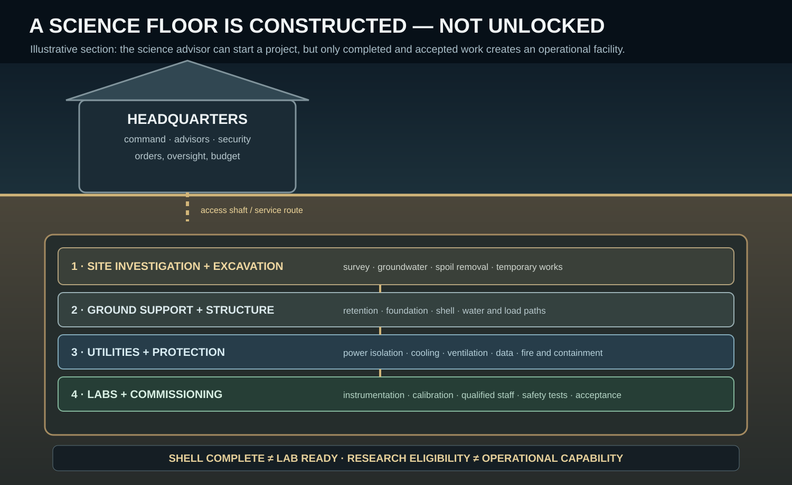

# raWWar Engineering Data Scape

Status: Living content architecture and authoring contract.

> **A capability is not a label. It is a physical arrangement of materials, components, power, interfaces, qualified people, procedures, supply and history.**



*Conceptual engineering illustration, not a construction-ready drawing. Each stage requires evidence and acceptance; a research idea does not make a laboratory operational.*

This document explains how the machine-readable engineering corpus fits together. It is intentionally more like an engineering data dictionary than a list of game bonuses.

## 1. The connected capability graph

```text
Resource / keyed material
        ↓ refining, batch identity and acceptance
Manufactured component / spare / upgrade kit
        ↓ stock, custody, dispatch and delivery
Chassis / building assembly / equipment asset
        ↓ sockets, physical envelope, utilities and interfaces
Installed configuration
        ↓ power, cooling, signals, software, protection and compatibility
Qualified crew + procedures + tools
        ↓ startup, operation, inspection, maintenance and repair
Measured performance + faults + acceptance records
        ↓ research feedback, capability history and next design iteration
```

The graph is not a linear unlock tree. It is a dependency graph with alternative routes, shared bottlenecks, incompatible interfaces, finite inventories, staffing constraints and historical consequences.

## 2. Data catalogues

| Catalogue | Authoritative responsibility | It does not imply |
|---|---|---|
| `resources.json` | Material identity, forms, provenance inputs and uses | That a resource is already refined or at the required location |
| `power-systems.json` | Generation, fuel inputs, nominal output, crew and failure modes | That a connected asset receives unlimited power |
| `vehicle-chassis.json` | Physical envelope, mass/payload, sockets, power budget, mobility, protection and serviceability | That every socket can be filled without compatibility checks |
| `vehicles.json` | A named configured vehicle and its operational role | That a named vehicle is ready without crew, stores, calibration and maintenance |
| `electronic-systems.json` | Electronic subsystem interfaces, load, isolation, faults, maintenance and technology gate | That signal wiring, power wiring, grounding and data freshness are interchangeable |
| `facilities.json` | Operational facility capability, inputs, outputs, procedures and dependencies | That the facility exists, is staffed, powered or commissioned merely because it is in the catalogue |
| `building-assemblies.json` | Physical construction definition, footprint, foundation, materials, connected/peak loads, contents, utilities and commissioning | That construction materials have arrived or the building has passed inspection |
| `security-systems.json` | Panel role, zone coverage, input/output points, backup, procedures and failure modes | Perfect detection, perfect identity, or automatic incident resolution |
| `technologies.json` | Research prerequisites and capabilities that become design-eligible | That research manufactures or installs an upgrade |
| `upgrades.json` | Compatibility, kit, labor, downtime, qualification, acceptance and field deployment | A global instant upgrade |
| `cut-sheets.json` | Commander-facing consequences and operator-facing watch points | A substitute for the engineering detail behind them |

Stable IDs are the joins between catalogues. Human-readable names may change; IDs should not change casually once persisted world state references them.

## 3. Vehicle assembly is a compatibility calculation

A chassis declares physical and electrical limits. A vehicle configuration selects modules that must fit those limits. Runtime validation should evaluate at least:

- hardpoint/socket type and count;
- module mass, center-of-mass effects and available volume;
- continuous and peak electrical load, voltage class, startup transient and backup duration;
- heat rejection, coolant flow and derating under environmental conditions;
- mechanical interface, mounting loads, vibration and access for maintenance;
- signal protocol, bandwidth, timing, isolation, grounding and data freshness;
- protection/interlock compatibility and behavior on lost power or stale data;
- crew positions, qualifications, stores, spares, tools and mission role;
- calibration, acceptance tests, configuration version and history.

A compatible socket is necessary, not sufficient. A module may fit mechanically yet exceed the power budget, overwhelm cooling, use an incompatible bus, or create an unserviceable installation.

## 4. Buildings are constructed systems, not bonuses

An assembly definition is the bridge between a facility's intended capability and the physical thing built in the world. It records:

- site and foundation assumptions that must be checked against terrain;
- shell and internal zones;
- estimated quantities of construction materials;
- connected and peak loads (which are not the same as energy consumption);
- equipment and workspaces actually inside the structure;
- utility interfaces, including access routes and service corridors;
- construction sequence, inspection holds, commissioning and operational staffing;
- consequences of a lost feeder, damaged utility, failed test or unavailable work area.

These values are initial authored simulation data. They are meant to be refined through playtesting and engineering detail, not misrepresented as construction-ready drawings or real-world specifications. Unknowns should be marked as unknown rather than hidden behind false precision.

## 5. Electronics, controls and the physical meaning of a fault

A sensor, relay, switchboard, gateway or interlock is a separately identifiable asset. Its state can include identity, installed revision, location, operating condition, calibration, last test, maintenance debt, connected interfaces and event history.

Examples of consequential faults include a relay coil that does not energize, a contact that welds, a sensor whose calibration drifts, a switchboard breaker that fails to trip, a cable route that is physically severed, a network that delivers stale information, or a bypass left active after maintenance. Each fault should affect the behavior it physically mediates; a fault should not merely subtract a generic percentage from a building's score.

Signal isolation also matters. A galvanically isolated interface can transfer information without a direct conductive signal path, but it does not eliminate the need to model its power supply, isolation rating, timing, failure modes, or verification.

## 6. Security is detection plus decision plus response

A security panel receives evidence from explicit devices and zones. Coverage has geometry, blind spots, occlusion, sensor health and environmental effects. The panel can raise an alarm, correlate sources and request a response; qualified people still investigate, decide and act.

Security state should include access policy revision, credential status, panel health, time quality, backup power, event storage, communications state and any authorized override. Critical bypasses are time-bounded, visible and recorded. An offline panel may continue under a declared degraded mode, but cached permissions can become stale.

## 7. Research is not deployment

An upgrade proceeds through a physical chain:

```text
Research evidence
 → design released
 → tooling and materials available
 → kit manufactured
 → quality accepted
 → inventory and keyed stock
 → dispatch
 → site / vehicle / ship receives kit
 → qualified installer and authorized work window
 → installation and configuration
 → functional / safety / performance test
 → accepted configuration record
 → operational benefit (subject to maintenance and conditions)
```

Personnel may be diverted to combat, a shipment may be delayed, a replacement may be rejected, or the receiving asset may lack a compatible interface. The world must represent those outcomes. An upgrade becomes available to a specific asset only when the required physical and procedural steps succeed.

## 8. Power is capacity, distribution and time

Generation output, connected load, coincident peak demand, reserve, backup duration, feeder topology, voltage class, power quality, protection coordination and heat rejection are separate quantities. A nominally adequate generator does not prove that every consumer can start simultaneously or survive a feeder casualty.

For each important installation, the next level of detail should include circuit/zone identity, feeder source, protective device, alternate feed, load-shed priority, essential/nonessential classification, isolation procedure, proof test and restoration order. Shipboard zonal isolation and base utility corridors must be modeled as physical topology so that a single damaged route can create common-mode failure.

## 9. FSM and micro-bundle implementation boundary

These files are content contracts, not a new monolithic game engine. Runtime capabilities should be exposed and composed through micro bundles. Candidate bundles include material identity/provenance, chassis compatibility, electronic asset behavior, facility construction, power distribution, security/access control, upgrade deployment, acceptance testing and maintenance scheduling. These are capability boundaries, not a requirement to create one bundle for every data file or class.

FSMs should represent discrete eligibility, procedural phases, interlocks, work orders, qualification, dispatch, installation, test and acceptance. Continuous physics and electrical calculations remain explicit models. Small FSMs should compose hierarchically rather than collecting unrelated behavior into enormous state machines.

GPU textures may hold compact state snapshots or bulk system fields, but a texture is a representation/cache, not the authority for persistent identity, ownership, event history or accepted configuration. Camera movement, texture rebuild, cache eviction and render rate must not alter the world.

## 10. Authoring and validation rules

1. Add a stable ID and explicit schema location before adding prose-only references to a new capability.
2. Prefer references to shared records over copying the same specification into multiple vehicles or buildings.
3. Distinguish nominal, peak, backup, degraded and unavailable states.
4. Declare units and clarify whether a value is measured, derived, assumed or a balance placeholder.
5. Model failure modes as observable causes with procedures, effects and repair paths.
6. Record qualification and tooling requirements for consequential work.
7. Keep research unlock, manufactured item, installed configuration and accepted capability as different states.
8. Make every transfer of valuable/keyed material auditable where provenance matters.
9. Test referential integrity automatically: IDs unique, references resolvable, prerequisites valid, and every facility linked to an assembly.
10. Treat data density as useful only when the added fields explain a real dependency, decision, observable condition or history.

## 11. Current coverage

The first engineering expansion includes 13 chassis, 23 electronic system records, 14 staffed facility/building assemblies, 11 power-distribution equipment records across 3 grid architectures, 9 security panels, 27 technology records, 16 upgrade definitions and 17 physical installation packages. The corpus also links all ten current vehicle records to their chassis and selected electronics, and links all fourteen facilities to assembly definitions. These are starting catalogues intended for continued expansion.
