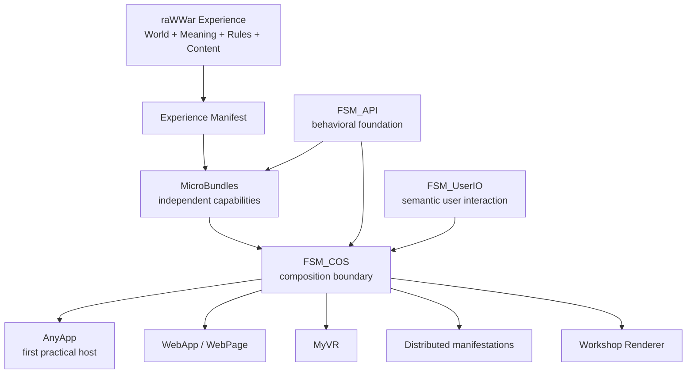
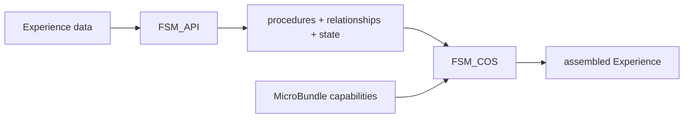
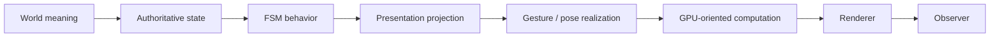

# raWWar — Experience Architecture

Status: Living companion design document.

> **The game is the Experience. The machinery is the Workshop.**

## Purpose

This document makes the boundary between **raWWar as an Experience** and **The Singularity Workshop as its enabling platform** explicit.

It exists because a game design document should not merely describe what players see. It should explain why the Experience can be built without becoming a monolithic game engine project.

## The visual model



The important point is that **raWWar does not own the bottom half of this diagram**. It consumes it.

## What the Experience actually owns

raWWar owns the things that make raWWar *raWWar*: the war, factions, world, soldiers, identities, qualifications, equipment, vehicles, facilities, combat, research, construction, missions, organizations, economics, narrative, terrain, weather, social behavior, persistence rules, and consequences.

Those are game design.

## What the Workshop provides

The Workshop should provide reusable machinery for state-driven behavior, composition, capability discovery, MicroBundle loading, manifestation, semantic user interaction, rendering, GPU-oriented presentation, persistence infrastructure, networking infrastructure, reconstruction, and cross-platform hosting.

> **Do not build Experience-specific infrastructure when a reusable Workshop capability should exist instead.**

## FSM_API → FSM_COS → Experience



FSM_API gives us the behavioral primitive. MicroBundles give us meaningful capability boundaries. FSM_COS composes those capabilities. The Experience supplies the meaning.

### Aircraft launch example

The game design says:

**aircraft + qualified crew + maintenance + procedure + weather + pad readiness → launch**

The Experience provides the entities, requirements, rules, and desired behavior. It should not need to invent a bespoke aircraft-launch manager merely to make that sequence happen.

The same pattern can support opening an aircraft hatch, entering a cockpit, launching a vehicle, repairing equipment, conducting research, constructing a wall, changing formation, saluting a commander, or responding to an alarm.

## The Experience Manifest

Conceptually:

```text
Experience
  ├─ identity
  ├─ version
  ├─ required capabilities
  ├─ MicroBundles
  ├─ configuration
  ├─ content
  ├─ presentation requirements
  └─ supported manifestations
```

The manifest should describe what the Experience is composed of, not become a giant list of implementation classes.

## AnyApp

AnyApp is the first practical manifestation target. Its job is to host the Experience.

raWWar should therefore not make AnyApp part of its game logic.

```text
raWWar
  ↓
Experience
  ↓
Manifest
  ↓
FSM_COS
  ↓
AnyApp
  ↓
Renderer + UserIO
```

The same Experience definition should eventually be consumable by other manifestations where their capabilities allow it.

## Renderer boundary

The Renderer observes authoritative state. It does not become authoritative merely because it is displaying something.



A rendered soldier is not the soldier. A simulation soldier can exist without being rendered.

## Event horizons

The Experience should define what matters at each observation scale.

| Horizon | Experience fidelity | Typical presentation |
|---|---|---|
| Near | Individual truth | identity, equipment, Gesture, interaction |
| Middle | Role + activity | squad behavior, equipment silhouette, movement, formation |
| Far | Population + event | formations, traffic, launches, construction, combat |
| Strategic | State + consequence | ownership, readiness, logistics, major movement |

This is intentionally broader than geometry. A soldier's ribbon, qualification, current duty, relationship, or behavior may be more important than another polygon.

## Data is detail

Traditional workflows often treat detail as geometry. The Workshop approach should not.

```text
Detail = geometry + identity + behavior + relationships + state + capability + history + context
```

The required detail changes with the observer and purpose.

## What we do not develop twice

| Do not duplicate inside raWWar | Instead |
|---|---|
| Generic FSM infrastructure | Consume FSM_API |
| Generic composition engine | Consume FSM_COS |
| Generic host shell | Consume AnyApp |
| Generic renderer | Consume Workshop Renderer |
| Generic semantic input system | Consume FSM_UserIO |
| Generic capability packaging | Use MicroBundles |
| Generic persistence machinery | Define requirements; consume Workshop infrastructure |
| Generic network transport | Define synchronization semantics; consume infrastructure |
| Generic GPU animation framework | Define Gesture semantics; use Renderer/GPU architecture |
| Generic manifest loader | Declare Experience composition |

This table should remain visible during implementation. Rebuilding one of these capabilities inside raWWar is an architectural smell.

## What we must develop

- soldier ontology and identity
- military organizations
- qualification system
- combat rules
- research systems
- construction rules
- terrain/world generation
- faction behavior
- mission generation
- military procedures
- narrative
- economy
- world history
- equipment and vehicle design
- environmental behavior
- social systems
- content
- the actual Experience

## The design-to-reality loop

```text
Vision → show something concrete → creator reacts → design becomes clearer
        ↓
identify required data / behavior / capability
        ↓
determine whether Workshop already provides it
        ↓
build only what is missing → demonstrate it → feed the result back
```

This is deliberately not a bureaucratic execution process. It is an **illumination loop**.

> **Do we now know enough to build the next thing?**

## Galaxy generation and cosmic address space

Galaxy generation is an Experience-owned world-generation rule, not a renderer trick or a fixed star-map lookup. The universe begins as a canonical 10 × 10 × 10 address space. Cell 42 is reserved as the galaxy's anchor; surrounding cosmic context is generated and baked while the galaxy itself remains unresolved until a new game's seed is supplied. Each cell can recursively subdivide into another 10 × 10 × 10 grid, with stable integer addresses and versioned deterministic generation.

The seed, canonical coordinates, generator version, and feature domain determine reproducible candidates. Physical constraints turn those candidates into coherent systems. Immutable generated properties may be reconstructed; discoveries and consequences of play must persist. The Renderer projects the result but never owns the universe's truth.

See [Galaxy Generation, Cosmic Context, and Spatial Refinement](GALAXY_GENERATION_AND_SPATIAL_REFINEMENT.md) for the full model.

## Relationship to the GDD

The master GDD remains the primary design document. This companion exists to make the architectural implications explicit. Material that matures here should eventually be absorbed into the master GDD.

## The ultimate test

If raWWar becomes a showcase for FSM_COS, the visitor should not leave thinking it was a clever FSM demonstration.

> **They should leave thinking: Holy shit, that world is alive.**

That is the purpose of the architecture.