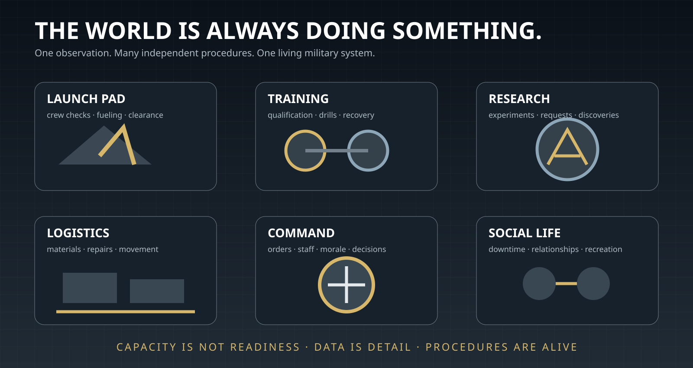
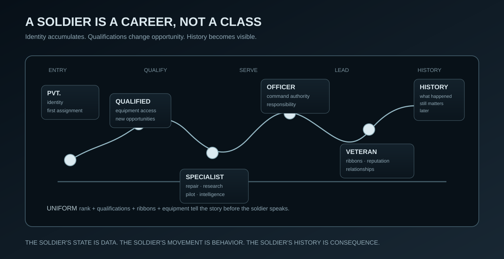
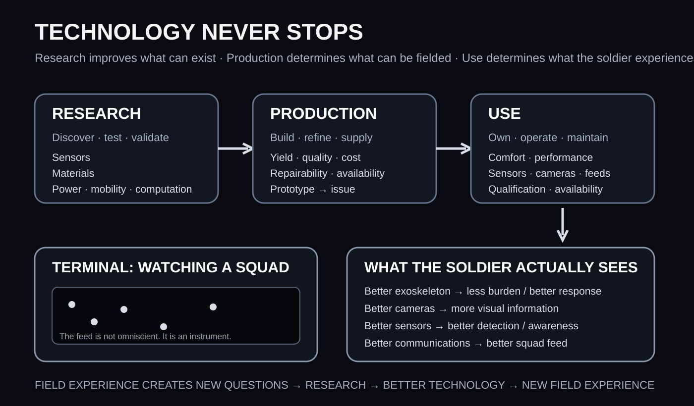
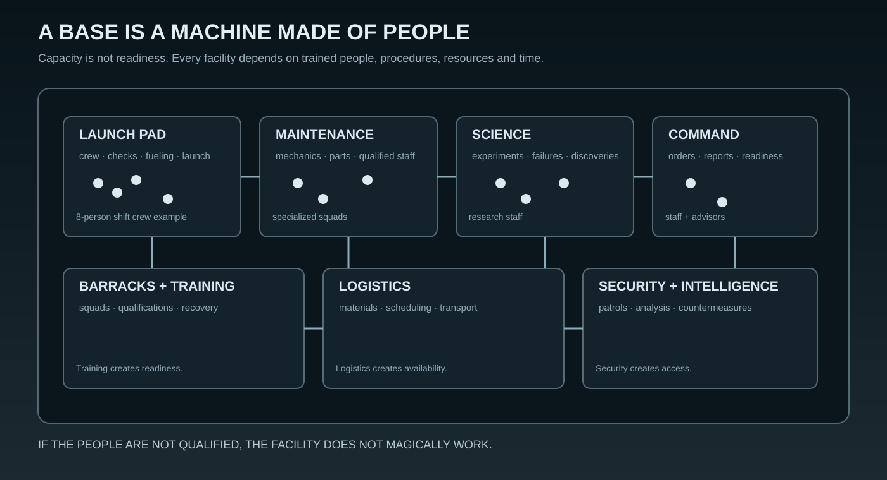
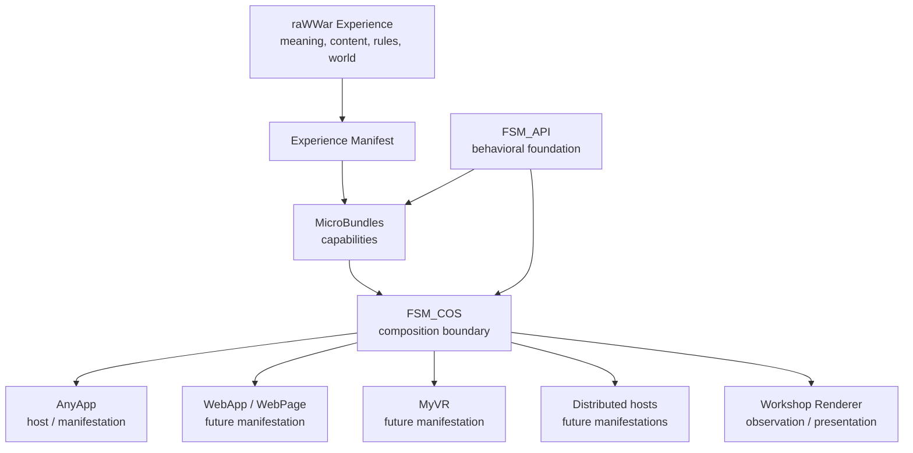
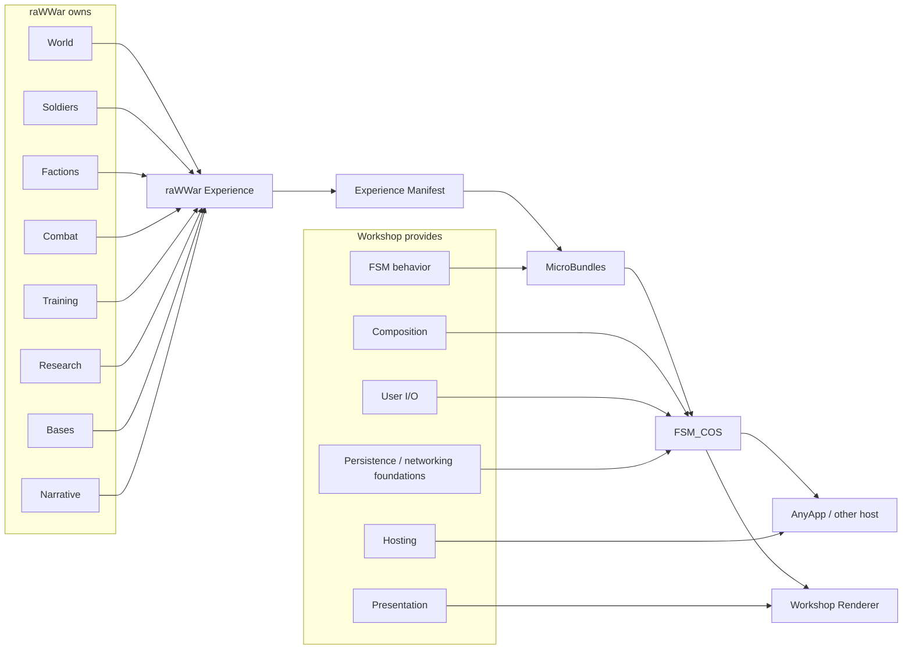
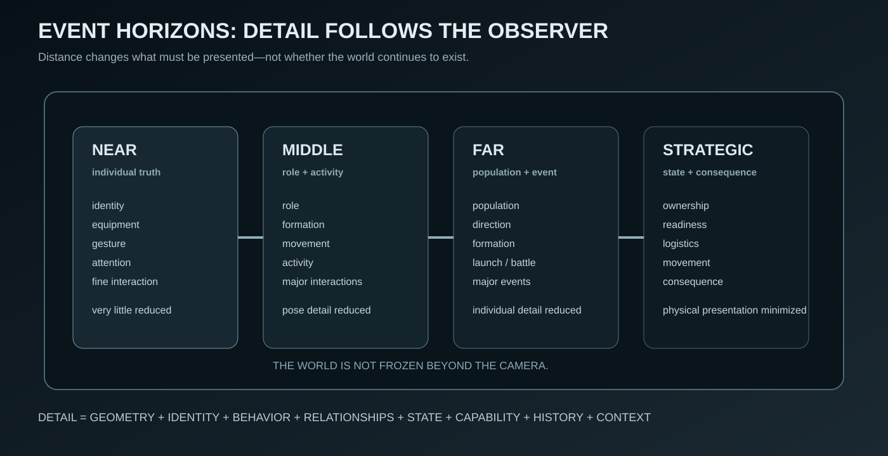

# raWWar — Game Design Document


> **The soldiers themselves are the stars of this game.**

**This document is supposed to make raWWar visible.**

The text defines the rules and intent, but the reader should not have to imagine everything from paragraphs. Wherever the design can be shown more clearly than it can be explained, this document should show it.



The target is not a collection of features. It is a world in which soldiers work, train, repair, research, command, socialize, march, fight, fail, recover, and develop histories while the larger military machine continues around them.

> **Read the words for the rules. Look at the visuals for the intent.**

## 0. What this document is

This is the comprehensive Game Design Document for **raWWar**, the flagship war Experience of The Singularity Workshop.

This is deliberately not a short pitch, feature list, or conventional game-design summary.

A real game design document must describe the game deeply enough that a reader can understand:

- what the player experiences;
- what exists in the world;
- what players can do;
- how soldiers, units, vehicles, facilities, factions, technologies, terrain, and organizations work;
- how the different play modes relate to one another;
- how progression works;
- how combat works;
- how research and construction work;
- how the world remains alive;
- how content is authored;
- how the technology supports the design;
- what is known;
- what is not yet known;
- and what questions must be answered before a system can become real.

The document is intentionally **alive**.

A section that is incomplete is not a failure of documentation. It is an instrument for discovering what the creator has not yet articulated.

When the document reaches a subject for which the creator's inner vision has not yet been expressed sufficiently, the document records an **Illumination Needed** marker instead of inventing an answer.

The companion design documents currently contain deeper treatment of individual subjects. Those documents are working design laboratories. Their mature material should ultimately be incorporated into this master document.

### Design authority

The project uses four design states:

- **Canon** — explicitly established by the creator.
- **Candidate** — a proposed interpretation awaiting confirmation.
- **Experiment** — something intentionally being tested.
- **Illumination Needed** — the subject requires creator vision before it should be designed further.

Implementation convenience must never silently become game design.

---

# 1. Executive Summary

raWWar is a fully first-person, immersive science-fiction war Experience.

It is not fundamentally a shooter with unrelated occupations attached to it.

It is a living war in which the player inhabits a person inside an enormous military organization.

A player may be a soldier, commander, pilot, mechanic, researcher, builder, intelligence operative, saboteur, crew member, scientist, logistics worker, or another role that emerges from the needs and opportunities of the organization.

Combat is important.

Combat is not the entire game.

The deeper proposition is:

> **Make being a person inside a war the game.**

The player should not merely select a class and receive a collection of abilities. The player should discover what they want to do, train for it, qualify for it, acquire the necessary equipment, join the appropriate organization, perform the work, experience consequences, and develop a history.

The world is enormous, but individuals matter.

A commander sees staffing levels, readiness, research programs, facilities, formations, fleets, logistics, and strategic conditions.

A soldier sees the same organization as people: friends, superiors, opportunities, equipment, missions, training, recreation, danger, responsibility, and a place in the machine.

The technology of The Singularity Workshop is not merely an implementation detail underneath this design. raWWar is intended to demonstrate why that technology exists.

---

# 2. The Design Pillars

## 2.1 Soldiers are the stars

Every major system ultimately exists to make the people inside the war meaningful.

Soldiers should have:

- identity;
- history;
- qualifications;
- rank;
- relationships;
- equipment;
- responsibilities;
- opportunities;
- limitations;
- personalities and variation;
- physical presence;
- consequences.

A soldier should not feel like a texture wrapped around a health bar.

## 2.2 The world is alive

The world should always be doing something.

Wherever the player looks, there should be evidence of an active system:

- soldiers training;
- formations moving;
- aircraft being serviced;
- scientists conducting experiments;
- construction progressing;
- materials moving;
- command staff monitoring operations;
- personnel eating, resting, talking, joking, complaining, repairing things, or simply living.

Not every entity needs maximum simulation fidelity at every moment.

The world must nevertheless preserve the impression—and eventually the underlying reality—of continuous life.

## 2.3 Work is gameplay

Repairing a vehicle is gameplay.

Research is gameplay.

Construction is gameplay.

Flying is gameplay.

Loading equipment is gameplay.

Training is gameplay.

Command is gameplay.

Intelligence work is gameplay.

Recreation is gameplay.

The player should perform meaningful activities rather than repeatedly interacting with abstract menus that represent them.

## 2.4 Qualification creates opportunity

The player should not be given a fixed occupation tree and told what they are.

The world should expose opportunities.

Qualifications allow the player to pursue them.

A qualification may provide:

- permission;
- knowledge;
- access;
- equipment compatibility;
- organizational eligibility;
- responsibility;
- career opportunity.

The exact qualification model remains an active design area.

## 2.5 First-person presence is fundamental

raWWar is always experienced from first person.

The player is physically present in the world.

Desktop presentation and VR presentation are different ways of receiving the same immersive world.

VR is not the definition of raWWar.

## 2.6 Consequences matter

The world should respond to what the player does.

Orders have consequences.

Failure has consequences.

Neglect has consequences.

Qualification has consequences.

Leadership has consequences.

Death is loss.

## 2.7 Technology should disappear into experience

The player should experience a living world, not a demonstration of a rendering engine.

The machinery underneath exists to make the experience possible.

---

# 3. What the Player Actually Is

## 3.1 Player identity

The player is a person inhabiting the world.

The player is not a floating camera.

The player has:

- a physical body;
- equipment;
- qualifications;
- rank/status;
- relationships;
- location;
- responsibilities;
- knowledge;
- history;
- consequences.

## 3.2 Campaign identity

The current campaign opening establishes the player as a **Commander**.

The precise history that led to that command remains to be illuminated.

### Illumination Needed — the player's history

Questions to answer:

- Who was the player before becoming Commander?
- Why were they promoted?
- What faction do they belong to?
- What have they already accomplished?
- What does the Empress know about them?
- Why does the Empress want them immediately?
- Who appointed them?
- Who expected them to fail?

## 3.3 Other modes

Other play modes may establish different starting contexts.

A persistent-universe character may develop from a much earlier point.

A cooperative campaign may place multiple players into a shared historical situation.

The exact identity model by mode remains to be fully designed.

---

# 4. The World


## 4.1 The war

raWWar requires a coherent conflict rather than an excuse for combat.

The war must explain:

- why the factions exist;
- why the Empire exists;
- why the Empress matters;
- why the player is involved;
- what is being fought over;
- what happens if either side wins;
- what ordinary people believe is happening;
- what the truth actually is.

### Illumination Needed — the war itself

This is one of the largest remaining areas requiring creator vision.

We need to illuminate:

- the historical origin of the conflict;
- the major factions;
- the Imperial structure;
- the Empress;
- the opposing powers;
- the geography of the conflict;
- the technology that makes the conflict possible;
- what each side wants;
- what each side fears;
- what victory means.

## 4.2 Factions

raWWar uses **thirteen major factions** rather than a three-house political triangle.

The galaxy is not divided into two balanced teams.

All thirteen factions stand in opposition to the Empress's will in some meaningful way, but they do so at radically different levels of alignment.

Internally, the factions form a hidden spectrum:

**1 — most aligned with the Empress → 7 — politically independent → 13 — openly hostile**

The player is not shown this spectrum.

The first faction-selection experience presents thirteen physical doors in that order. A player who immediately enters the first door may unknowingly choose the faction most willing to serve Imperial interests. A player who explores can discover the political spectrum through architecture, personnel, literature, recruitment material, military doctrine, history, and conversation.

This is deliberately a discovery rather than a faction-selection stat screen.

> **Political alignment is not morality.**

Some factions may be admirable in one respect and monstrous in another. Some may cooperate with the Empress while genuinely improving the lives of their people. Some may oppose her while becoming tyrannical themselves.

See [Faction Design](FACTIONS.md) for the working thirteen-faction catalogue, hidden alignment gradient, dynamic political graph, global simulation model, and faction-selection experience.

### 4.2.1 The galaxy is not waiting for the player

Factions continuously act without the player's involvement.

They:

- plot;
- fight;
- trade;
- research;
- build;
- recruit;
- sabotage;
- negotiate;
- betray;
- lose battles;
- win battles;
- fracture;
- recover.

A conflict can begin and end in a region the player never visits.

The player later encounters its consequences.

> **The galaxy does not generate conflict because the player arrived. Conflict was already happening.**

### 4.2.2 No victory ceremony

There is no universal victory screen for conquering territory or winning a battle.

A victory changes the authoritative world:

- territory may change hands;
- resources may become available;
- personnel may be gained or lost;
- political relationships may change;
- research opportunities may open;
- prestige may increase;
- new enemies may emerge;
- new responsibilities may appear.

The player continues living in the changed world.

> **There is no victory screen because the war did not stop.**

### 4.2.3 Galactic simulation

The galaxy must continue to tick everywhere.

It should not, however, require identical processing frequency everywhere.

The intended conceptual hierarchy is:

**Galaxy field → global tick → regional/system activity → focused simulation**

The entire galaxy receives continued simulation.

Focus changes resolution and frequency.

A remote battle does not freeze because the player is elsewhere.

The global layer can maintain low-cost state such as:

- faction relationships;
- ownership;
- major military movement;
- resource production;
- strategic logistics;
- research progress;
- diplomatic events;
- battles;
- population changes;
- political events;
- major discoveries and losses.

Systems with meaningful activity can receive more frequent evaluation.

Player-focused areas can resolve individual units, crews, vehicles, procedures, logistics, and local combat at high fidelity.

The central rule is:

> **Focus changes simulation resolution. It does not create simulation existence.**

A GPU-friendly texture/field representation of broad galactic state is a promising architectural direction. It remains a Candidate implementation detail. The authoritative world is semantic data; the texture is a representation of that world, not the world itself.


### Faction capability and sub-faction inheritance

Major factions contain persistent sub-factions: worlds, colonies, moons, asteroids, habitats, industrial districts, and other local organizations. Major-faction doctrine establishes capability tendencies; local infrastructure, resources, research, acquisition, capture, and history determine what each sub-faction actually fields. See [Faction Capability Matrix](FACTION_CAPABILITY_MATRIX.md).

### Warp navigation

Warp travel is strategically slow because warp bubbles cannot safely form within or intersect stellar gravitational wells. Routes must flex around hazardous stars. Navigation-system capability and crew skill affect route planning and preparation; the exact physics and risk model remain candidate design. See [Warp Navigation & Skills](WARP_NAVIGATION_AND_SKILLS.md).

### Individual skills and experience

Soldiers are persistent skill-bearing individuals. Training establishes qualifications and controlled capability; meaningful real-world activity builds experience and can improve relevant skills. Skill, qualification, permission, and readiness remain distinct. The intended philosophy is GURPS-like in breadth, not a dependency on GURPS rules.

## 4.3 Geography

The world should support military geography rather than being a collection of disconnected maps.

Potential geographic concepts include:

- cities;
- military bases;
- industrial regions;
- research facilities;
- spaceports;
- orbital installations;
- wilderness;
- strategic corridors;
- contested territory;
- Imperial centers;
- faction strongholds;
- remote installations.

### Illumination Needed — world geography

We need the creator's vision for:

- the overall planet/universe structure;
- number and type of major regions;
- scale;
- climate;
- population;
- transportation;
- strategic geography;
- how locations relate to one another.

---

# 5. The Campaign Opening

The opening is an intentional lesson rather than a conventional tutorial.

## 5.1 Sequence

1. The raWWar moniker appears.
2. Lightning flashes.
3. The scene becomes overilluminated.
4. The player is looking through a massive window approximately eighty floors above a huge active square.
5. Rain and weather continue.
6. An obscene Imperial palace dominates the opposite side of the square.
7. The exterior remains alive while the player observes it.
8. The player moves.
9. Loud airtight doors open.
10. Two Imperial soldiers move rapidly toward the player.
11. They announce that the Empress wants the Commander immediately.
12. The player recognizes the faction headquarters.
13. Faction offices can be explored.
14. Dogma, literature, recruiting material, and physical evidence reveal competing beliefs.
15. The Imperial soldiers expect immediate compliance.
16. Failure to proceed results in execution.

## 5.2 What the opening teaches

Without a conventional tutorial, the opening establishes:

- the world is physically present;
- observation matters;
- the player has obligations;
- authority is real;
- factions have beliefs;
- exploration is possible;
- exploration does not suspend danger;
- the world expects the player to learn through consequence.

## 5.3 Death in the opening

The soldiers give approximately five seconds to comply.

If the player refuses:

- both soldiers raise their weapons;
- a three-second countdown occurs;
- the player is executed.

The player is given enough information to understand the consequence.

The lesson is not intended to be cheap.

---

# 6. Death, Failure, and Consequence

## 6.1 Death

Death is immediate loss of the current attempt.

The intended rule is:

> **Do not die.**

Possible deaths include:

- assassination;
- enemy invasion;
- combat failure;
- death during an assault;
- landmines;
- vehicle destruction;
- environmental hazards;
- other lethal events.

## 6.2 Checkpoints

Campaign checkpoints may prevent unnecessary repetition.

They do not change the meaning of death.

## 6.3 Other modes

Campaign, cooperative, competitive, and persistent modes may require different persistence consequences.

### Illumination Needed — death across modes

We need to define:

- what survives a campaign loss;
- what survives a cooperative failure;
- whether a persistent-universe character can permanently die;
- whether replacement characters inherit anything;
- what happens to equipment;
- what happens to organizations;
- whether death creates historical consequences.

---

# 7. Modes of Play

The intended modes are:

1. Campaign — Soldier
2. Campaign — Officer
3. Campaign — Cooperative
4. Multiplayer — Free For All
5. Multiplayer — Team vs Team
6. Multiplayer — Persistent
7. Massively Online — Fully Persistent Universes

## 7.1 Campaign — Soldier

The player experiences the war primarily from the soldier level.

The player may:

- train;
- qualify;
- deploy;
- march;
- accept missions;
- fight;
- repair;
- research;
- construct;
- pilot;
- socialize;
- recreate;
- pursue specialized occupations.

## 7.2 Campaign — Officer

The player experiences the organization from a command role while remaining physically present in the world.

## 7.3 Campaign — Cooperative

The intended scale is approximately 2–128 players.

Cooperation does not necessarily mean everyone belongs to the same faction.

Players may have:

- different factions;
- different objectives;
- different information;
- different loyalties;
- overlapping interests.

### Illumination Needed — cooperative structure

We need to define how:

- shared objectives work;
- command works;
- faction conflicts work;
- information is shared;
- players can cooperate despite conflicting interests;
- missions scale from 2 to 128 participants.

## 7.4 Free For All

A competitive mode where individual players or entities pursue their own objectives.

### Illumination Needed

Define the actual FFA structure, objectives, persistence, map size, and victory conditions.

## 7.5 Team vs Team

Team warfare should use the same underlying military systems rather than a disconnected arcade ruleset.

### Illumination Needed

Define:

- team organization;
- objectives;
- victory;
- respawn/death;
- equipment;
- command;
- map structure.

## 7.6 Persistent multiplayer

A player can participate in a continuing world.

## 7.7 Fully persistent universes

Each persistent universe begins from the same premise but evolves independently.

Players may join at any point.

If a player loses, they may potentially return as a new faction or new participant.

Each persistence is independent.

Approximately 25% of raWWar revenue is a candidate commitment toward sustaining persistent universes once actual persistence/storage/usage costs are understood.

### Pocket dimensions

A candidate concept is that persistent universes may become effectively impossible to locate from outside their own context, creating rare possibilities for crossing between universes.

This is a narrative/system concept and remains to be developed.

---

# 8. Soldier Design



> **A soldier is a career, not a class.**


## 8.1 The soldier is the fundamental unit of experience

A soldier is simultaneously:

- a person;
- a military participant;
- a physical body;
- an organizational member;
- a qualification holder;
- an equipment owner/operator;
- an FSM participant;
- a relationship node;
- a renderer-visible entity.

## 8.2 Soldier life

A soldier can:

- train;
- qualify;
- receive orders;
- march;
- deploy;
- fight;
- maintain equipment;
- operate machinery;
- conduct research;
- build;
- socialize;
- eat;
- sleep/rest;
- play;
- gamble with in-world currency;
- pursue advancement;
- form relationships;
- change occupations.

## 8.3 Squad structure

A barracks supports a squad of four.

Advanced facilities and vehicles can require multiple specialized squads.

Each squad role therefore creates training, staffing, housing, qualification, and readiness requirements.

## 8.4 Military precision

Soldiers should behave according to actual organizational rules.

They are not interchangeable animation actors.

Examples include:

- formations;
- road guards;
- marching cadence;
- salute/attention procedures;
- safety procedures;
- staffing requirements;
- launch procedures;
- maintenance procedures;
- command acknowledgements.

---

# 9. Command and Leadership

## 9.1 Command is a physical occupation

The commander exists inside the organization.

The commander:

- walks through headquarters;
- talks to staff;
- observes operations;
- interacts with researchers;
- requests demonstrations;
- commissions reviews;
- makes decisions;
- visits facilities;
- joins battles.

## 9.2 Commander presence

When the Commander enters a room:

- soldiers announce **“Commander on deck”**;
- personnel come to attention;
- personnel salute where procedure permits.

Critical work takes precedence.

A throttleman with hands controlling a critical system should not abandon that task merely to salute.

This is a systemic procedure, not a universal animation trigger.

## 9.3 Command presence

The physical presence of command should affect the organization.

Potential influences include:

- leadership reputation;
- recent victories/losses;
- treatment of personnel;
- confidence;
- speeches;
- reviews;
- operational success;
- direct interaction;
- visible command presence.

The exact morale model remains to be designed.

## 9.4 Military reviews

A commander may pay for military reviews.

Reviews can provide opportunities for:

- speeches;
- ceremonial presence;
- troop motivation;
- inspection;
- leadership interaction.

A well-delivered speech may motivate troops to accomplish extraordinary objectives.

### Illumination Needed

Define:

- how a speech is delivered;
- what determines quality;
- how troops respond;
- how morale changes;
- how long effects last;
- whether speeches can fail;
- whether troops remember leadership behavior.

## 9.5 Personal command participation

A commander can join a battle personally.

Potential benefits include:

- morale;
- bonuses;
- direct decision-making;
- bodyguards;
- unique opportunities.

The player remains in first person.

## 9.6 Headquarters confrontation

A major command scenario can involve:

1. infiltrating an enemy base;
2. reaching enemy headquarters;
3. breaching defenses;
4. clearing the area;
5. reaching the blast doors separating the enemy commander;
6. breaching them;
7. fighting through close quarters;
8. confronting the enemy commander;
9. communicating directly;
10. choosing execution, imprisonment, or release.

The confrontation should preserve player agency rather than become a cutscene.

---

# 10. Training and Qualification

Training is a primary pillar of raWWar.

## 10.1 Qualification

Qualifications can unlock:

- occupations;
- equipment;
- facilities;
- vehicles;
- research;
- construction;
- command;
- intelligence;
- specialized duties.

## 10.2 Physical representation

The player's history should become visible.

Potential physical indicators include:

- rank insignia;
- ribbons;
- ratings;
- equipment;
- wear;
- specialized tools;
- uniform configuration.

## 10.3 Qualification paths

Potential paths include:

- mechanics;
- research;
- construction;
- piloting;
- command;
- intelligence;
- sabotage;
- specialized equipment;
- vehicle operation;
- weapons;
- aerospace;
- fleet operations.

## 10.4 Officer training

Some qualifications may require a status transition.

Flight training may require officer status.

Officer boot camp may use immersive simulation.

The candidate experience is intentionally disruptive:

- expose trainee to pressure;
- place them in command;
- create difficult situations;
- challenge assumptions;
- break the expected pattern;
- allow recovery;
- reveal what the trainee is suited for;
- offer the next qualification path.

## 10.5 Skill-tree-like discovery

Progression is currently best understood as qualification discovery rather than fixed classes.

The player sees opportunities and chooses what to pursue.

### Illumination Needed — qualification graph

We need to define:

- qualification hierarchy;
- prerequisites;
- rank requirements;
- training duration;
- instructors;
- facilities;
- examinations;
- failure;
- renewal;
- proficiency;
- organizational demand;
- whether qualifications decay.

---

# 11. Equipment and Customization

## 11.1 Exoskeleton foundation



The visual and mechanical foundation is an original science-fiction exoskeleton system.

An entry-level exoskeleton is only the beginning. In essence, **everything can be upgraded**.

The meaningful question is not simply whether a better component exists. It is:

> **Who researched it, who can produce it, who can afford it, who can maintain it, and who actually gets to use it?**

## 11.2 Research, production, and use are different progressions

Technology does not become useful merely because somebody discovered it.

raWWar deliberately separates three related but distinct progressions:

1. **Research** — discovers, improves, validates, and demonstrates what technology can do.
2. **Production** — determines whether that technology can actually be manufactured, at what quality, quantity, cost, and reliability.
3. **Use** — determines who receives it, can operate it, can maintain it, can afford it, and experiences its benefits.

A research breakthrough can therefore exist long before it is common equipment.

A production breakthrough can make an existing technology cheaper, smaller, more reliable, more comfortable, or more available without changing the underlying scientific discovery.

A soldier with expensive equipment can perform differently from a soldier carrying standard issue even when both are using the same technological generation.

This is not a conventional vertical tech tree. It is a living relationship between **knowledge, industry, ownership, maintenance, and experience**.

## 11.3 Equipment categories

Potential dimensions include:

- chassis;
- armor;
- power;
- mobility;
- sensors;
- cameras;
- communications;
- displays;
- comfort/ergonomics;
- tools;
- weapons;
- specialist modules;
- decorations;
- personal modifications.

## 11.4 Equipment as capability

Equipment should affect gameplay.

It may change:

- qualifications;
- power consumption;
- maintenance;
- weight;
- mobility;
- readiness;
- compatibility;
- operational role;
- survivability;
- sensory quality;
- operator comfort;
- reliability;
- interaction options.

## 11.5 Personal ownership

Players may acquire equipment beyond military issue.

Candidate possessions include:

- armor;
- decals;
- vehicles;
- specialized equipment;
- personally owned tanks.

Vehicles may use:

**chassis + available parts → configured vehicle**

Customization may trade resources for:

- performance;
- capability;
- expression;
- maintenance burden.

## 11.6 Technology quality is observable

Technology quality should be visible through use.

Two soldiers may stand beside one another and see the same battlefield differently because their equipment differs.

The difference should not require a floating comparison screen. It can simply be true:

- one camera resolves more detail;
- one sensor sees farther;
- one display provides better information;
- one exoskeleton responds more naturally;
- one communications package provides cleaner or more useful information;
- one piece of equipment fails less often.

This makes equipment an extension of the soldier's lived experience.

## 11.7 Observation terminals and squad feeds

Military bases and command spaces can contain terminals where a soldier or operator watches a squad through remote cameras and sensors.

The feed is a manifestation of the underlying observation state.

If the observing soldier has better cameras, sensors, displays, or communications available to them, **the quality of what they see on the feed improves**.

The observer is not receiving an omniscient game camera. They are receiving information through an actual sensor and communications chain.

A terminal operator might watch:

- a squad moving through terrain;
- a vehicle crew performing a procedure;
- a remote installation;
- a battle;
- a patrol;
- an operation requiring supervision.

This gives observation technology gameplay meaning and creates a natural connection between equipment progression and Event Horizons.

## 11.8 Mode-specific customization

Persistent universes may permit substantially more customization than campaign or cooperative play.

### Illumination Needed

Define exactly what is:

- military issue;
- earned;
- purchased;
- discovered;
- crafted;
- faction-specific;
- persistent-universe-only.
---

# 12. Vehicles

Vehicles are capabilities, not merely meshes.

A vehicle can contain:

- crew requirements;
- qualifications;
- interaction points;
- procedures;
- maintenance;
- fuel/power;
- weapons;
- sensors;
- damage;
- readiness;
- Gesture Providers.

## 12.1 Crew

Some vehicles require multiple qualified personnel.

A vehicle may therefore be physically present while remaining unavailable because the organization lacks the required people.

## 12.2 Aircraft and VTOL

Aircraft may require:

- pilots;
- ground crews;
- launch-pad crews;
- maintenance;
- logistics;
- weapons personnel.

A launch pad may require an eight-person crew per shift.

Insufficient staffing creates inoperable periods.

## 12.3 Spacecraft

Spacecraft can expose:

- helm;
- weapons;
- engineering;
- tactical displays;
- command;
- communications;
- research;
- flight control.

## 12.4 Vehicle interaction

The vehicle's MicroBundle can expose the physical procedures required to operate it.

Example:

**soldier → semantic request: “enter cockpit” → vehicle Gesture Provider → interaction point → Gesture FSM → physical entry**

---

# 13. Gestures and Physical Motion

A Gesture is the physical procedure by which an intended action becomes movement.

## 13.1 Ideal motion

A Gesture is represented conceptually as:

- poses;
- pose relationships;
- mathematical transition equations;
- timing/progression;
- anchors;
- constraints.

The ideal Gesture defines what the movement should accomplish.

## 13.2 Fuzzy individual motion

If ten thousand soldiers perform the same ideal movement identically, the population looks mechanically animated.

Each soldier therefore uses stable identity information and current state to create bounded variation.

Variation may include:

- speed;
- lateral offset;
- timing;
- stride;
- head direction;
- posture;
- reaction;
- recovery;
- small stumbles;
- correction;
- attention.

The purpose is not random chaos.

The purpose is believable individuality.

## 13.3 Gesture Providers

The capability that owns the physical interaction provides the Gesture.

A tank knows how a soldier enters its hatch.

A building knows how a soldier enters its door.

A machine knows how it is operated.

The soldier queries semantically rather than containing hard-coded knowledge of every object.

## 13.4 Movement versus Gesture

Generic movement gets the soldier to the interaction point.

The target capability supplies the domain-specific physical procedure.

## 13.5 GPU realization

Gesture evaluation is a natural GPU workload when large populations share the same mathematical structure.

Compact state can identify:

- current pose;
- target pose;
- progress;
- variation seed;
- event horizon;
- relevant equipment/context.

The exact representation is not yet a frozen API.

## 13.6 Event horizons

Near observation:

- detailed pose;
- equipment interaction;
- head/attention;
- fine movement;
- high update frequency.

Middle observation:

- reduced pose complexity;
- fewer secondary details;
- coarser updates;
- preserved identity and major motion.

Far observation:

- population-level motion;
- cheaper pose;
- reduced frequency;
- silhouette and formation dominate.

The transition must remain visually coherent.

---

# 14. Combat

Combat is one occupation within the war, but it must be deep enough to support the Experience.

## 14.1 Ground combat

Ground combat can involve:

- individual soldiers;
- squads;
- formations;
- vehicles;
- bases;
- fortifications;
- artillery;
- air support;
- logistics;
- intelligence;
- command.

### Illumination Needed — combat model

The creator's vision is needed for:

- weapon model;
- damage;
- armor;
- cover;
- suppression;
- wounds;
- ammunition;
- healing;
- squad tactics;
- command;
- visibility;
- stealth;
- death;
- battlefield scale.

## 14.2 Air combat

Players can qualify as:

- fighter pilots;
- bomber pilots;
- weapons operators;
- tactical operators;
- other aviation roles.

## 14.3 Space combat

Space combat can involve massive fleets.

Players may occupy:

- fighter cockpits;
- bomber stations;
- weapons consoles;
- tactical displays;
- helm;
- engineering;
- command ships;
- fleet command.

### Illumination Needed — space warfare

Define:

- ship scale;
- fleet scale;
- propulsion;
- weapons;
- defenses;
- tactical doctrine;
- boarding;
- command;
- communications;
- logistics;
- strategic objectives.

---

# 15. Research

Research is a physical occupation.

A player can qualify for a research squad and perform laboratory work.

## 15.1 Research interaction

A conceptual research sequence can include:

1. obtain material;
2. handle a beaker;
3. pour into another vessel;
4. activate equipment;
5. light a burner;
6. place vessel over heat;
7. observe;
8. record findings;
9. interpret results;
10. continue or conclude.

The system should provide subtle hints rather than turning the laboratory into a conventional menu.

## 15.2 Research pipeline

Research is the process by which the organization discovers what is possible and makes it reliable enough to become technology.

Candidate pipeline:

**question → experiment → observation → result → validation → technology → demonstration → production design → deployment → operational feedback → improvement**

Research is therefore continuous.

A deployed technology is not necessarily finished. Operational experience can reveal weaknesses, unexpected opportunities, manufacturing problems, maintenance burdens, comfort issues, sensor limitations, or entirely new research questions.

### 15.3 Research improves technology; production improves availability

Research and production are intentionally separate.

Research can improve:

- capability;
- efficiency;
- materials;
- sensor quality;
- processing;
- power usage;
- reliability;
- ergonomics;
- miniaturization;
- range;
- accuracy;
- survivability.

Production can improve:

- manufacturing yield;
- consistency;
- cost;
- throughput;
- repairability;
- maintainability;
- supply;
- component quality.

Use then determines what those improvements mean to an individual soldier.

A revolutionary prototype may be extraordinarily capable and nearly impossible to obtain.

A mature production revision may be less spectacular but cheap enough to issue to thousands of soldiers.

### 15.4 Technology never stops improving

There should be no assumption that a technology reaches a final immutable tier.

The organization can continue researching an already deployed technology.

The practical progression can therefore look like:

**Mk I → field experience → research → Mk II → production refinement → broader issue → field experience → Mk III ...**

This is not necessarily a discrete tier system in the player's interface. It is a living technology history.

### Illumination Needed

Define:

- research disciplines;
- scientific institutions;
- experiment generation;
- discovery;
- failure;
- technology validation;
- production engineering;
- manufacturing capacity;
- military adoption;
- civilian adoption;
- sabotage/theft;
- how much of the improvement process is player-directed.

---

# 16. Construction

Construction is gameplay.

Buildings are constructed from physical components such as extruded preformed plates.

A player can:

- qualify as construction personnel;
- receive materials;
- transport materials;
- place components;
- follow construction directions;
- operate equipment;
- work as part of a construction squad.

Construction should visibly progress in the world.

### Illumination Needed

Define:

- building grammar;
- structural systems;
- construction machinery;
- material production;
- logistics;
- damage/repair;
- procedural building generation;
- player-created structures.

---

# 17. Bases and Structures




A military base is a functioning organization, not a collection of decorative buildings.

## 17.1 Base systems

A base may contain:

- barracks;
- command centers;
- launch pads;
- aircraft;
- vehicle maintenance;
- research facilities;
- logistics;
- security;
- training;
- construction;
- recreation;
- communications;
- medical facilities;
- power;
- storage;
- transportation.

## 17.2 Capacity versus readiness

A facility can exist without being operational.

Operational status depends on:

- staffing;
- qualification;
- maintenance;
- supplies;
- power;
- equipment;
- schedules;
- procedures.

> **Capacity is not the same thing as readiness.**

## 17.3 Living base

The base should visibly reveal its organizational state.

If staffing is low:

- equipment waits;
- launches are delayed;
- schedules change;
- personnel become overextended.

If staffing is healthy:

- procedures run;
- crews move;
- vehicles launch;
- maintenance occurs;
- training proceeds.

---

# 18. Organizations and Military Procedure

The world is governed by rules.

## 18.1 Rules

Soldiers obey rules established by their organization and commander.

Rules can govern:

- formations;
- traffic;
- safety;
- staffing;
- saluting;
- movement;
- launch procedures;
- maintenance;
- command;
- access;
- equipment.

## 18.2 Learning procedures

Organizations may discover new procedures from failure.

Example:

A squad is run over by a tank while crossing a roadway.

The organization responds by establishing:

- a minimum marching formation;
- road guards;
- traffic control;
- safe crossing procedure.

The resulting rule becomes visible behavior.

## 18.3 Emergent organization

The objective is not merely to animate military behavior.

The world should exhibit:

- memory;
- procedure;
- adaptation;
- hierarchy;
- responsibility;
- organizational consequences.

---

# 19. Intelligence and Sabotage

Players can:

- send spies;
- send saboteurs;
- become spies;
- become saboteurs;
- investigate;
- infiltrate;
- deceive;
- discover information;
- interfere with enemy operations.

These roles use the same qualification and organizational model as other occupations.

### Illumination Needed

Define:

- concealment;
- identity;
- false identities;
- intelligence collection;
- counterintelligence;
- detection;
- interrogation;
- sabotage;
- consequences;
- information reliability.

---

# 20. Economy and Personal Life

## 20.1 raWWar digital currency

The in-world economy uses raWWar digital currency.

The arcade can use it for games of chance.

This is an in-world economy, not real-money gambling.

## 20.2 Personal economy

Soldiers can pursue:

- possessions;
- equipment;
- vehicles;
- customization;
- status;
- recreation.

The personal economy exists inside the military economy.

## 20.3 Arcade and recreation

The arcade can contain:

- gambling games;
- air hockey;
- other games;
- social activities.

Downtime should remain part of the world.

### Illumination Needed

Define:

- income;
- pay;
- prices;
- ownership;
- scarcity;
- trading;
- gambling mechanics;
- economic progression;
- consequences of wealth.

---

# 21. Terrain and Map Generation

Terrain is not merely a visual surface.

Terrain determines:

- movement;
- visibility;
- cover;
- logistics;
- construction;
- settlement;
- agriculture/resources if applicable;
- military strategy;
- transportation;
- weather;
- environmental hazards;
- battlefield shape.

## 21.1 Map types

Potential environments include:

- cities;
- military bases;
- wilderness;
- industrial areas;
- deserts;
- forests;
- mountains;
- coastlines;
- orbital environments;
- space.

### Illumination Needed — terrain vision

We need to define:

- procedural versus authored terrain;
- planet scale;
- biome system;
- erosion;
- rivers;
- roads;
- infrastructure;
- strategic generation;
- destructibility;
- map persistence;
- player modification.

## 21.2 Terrain generation

The eventual system should distinguish:

- world generation;
- strategic map generation;
- tactical map generation;
- local detail;
- procedural structures;
- authored landmarks.

---

# 22. Weather and Environment

Weather is part of the world, not merely a screen effect.

The opening establishes:

- rain;
- lightning;
- changing illumination;
- atmospheric conditions.

Environmental conditions can affect:

- visibility;
- movement;
- equipment;
- aircraft;
- sensors;
- combat;
- logistics;
- construction;
- morale.

### Illumination Needed

Define the environmental simulation model and which weather phenomena materially affect gameplay.

---

# 23. Population Scale

The intended world can contain:

- hundreds of thousands of soldiers;
- hundreds of scientists;
- support personnel;
- maintenance;
- logistics;
- grounds crews;
- construction workers;
- aircraft crews;
- facility operators.

## 23.1 Simulation does not equal maximum detail

The architecture must distinguish:

- authoritative world state;
- behavioral state;
- presentation state.

A distant soldier does not need the same computation as a soldier standing in front of the player.

## 23.2 Event horizons

Observation determines presentation and computational detail.

The system should spend effort where it produces meaningful player-visible consequences.

## 23.3 Individuality at scale

Even at enormous population counts, individual soldiers should be capable of stable identity and bounded variation.

The population should not collapse into a collection of identical animated units.

---

# 24. Narrative and Storytelling

Narrative exists through:

- direct events;
- dialogue;
- faction material;
- environmental evidence;
- rumors;
- mundane conversation;
- military procedure;
- consequences;
- player decisions.

## 24.1 Mundane life

Background conversations may involve:

- being stuck in a suite;
- bathroom complaints;
- eating;
- equipment problems;
- relationships;
- jokes;
- boredom;
- promotions;
- rumors.

Not every conversation should explain the plot.

The point is to make people feel like people.

## 24.2 Environmental storytelling

Buildings, uniforms, equipment, posters, faction offices, literature, damage, repairs, and procedures should reveal history.

### Illumination Needed

Define:

- major story arc;
- campaign acts;
- major characters;
- faction histories;
- mysteries;
- endings;
- player agency;
- branching consequences.

---

# 25. Social Systems

The world contains relationships between people.

Potential relationship dimensions include:

- friendship;
- trust;
- loyalty;
- command confidence;
- rivalry;
- mentorship;
- romance if appropriate to the world;
- reputation;
- faction allegiance.

### Illumination Needed

Define which relationships are intended and how deeply they affect gameplay.

---

# 26. Audio

Audio should reinforce physical presence.

Important sound categories include:

- machinery;
- footsteps;
- doors;
- armor;
- weapons;
- aircraft;
- vehicles;
- weather;
- command announcements;
- cadences;
- conversations;
- alarms;
- laboratory equipment;
- construction.

The environment should sound active even when the player is not directly interacting with it.

### Illumination Needed

Define the musical identity, faction audio language, combat audio philosophy, and ambient sound strategy.

---

# 27. Visual Direction

The visual identity should be original.

The broad emotional neighborhood includes:

- technologically advanced exoskeleton warfare;
- massive military infrastructure;
- strong silhouettes;
- heavy equipment;
- individualized armor;
- technological escalation;
- extreme but coherent customization.

External games and fiction may provide inspiration, but they are not design authorities.

## 27.1 Soldiers

Soldiers are the primary visual subject.

The exoskeleton provides a modular foundation.

A soldier's appearance should communicate:

- rank;
- qualifications;
- equipment;
- role;
- history;
- maintenance;
- individuality.

## 27.2 Vehicles

Vehicles should share a coherent technological family with soldier equipment while retaining distinct roles.

## 27.3 Infrastructure

Infrastructure should communicate scale.

A major base should look capable of supporting the organization it contains.

---

# 28. User Experience and Interaction

The player should interact with the world rather than a collection of abstract screens.

Interaction should expose:

- what is possible;
- what is required;
- what is happening;
- what the player needs to do next.

The world can communicate through:

- physical cues;
- animation;
- sound;
- contextual prompts;
- breathing controls;
- equipment behavior;
- personnel behavior.

## 28.1 Shadow guidance

An AI or human player can receive a shadow of the intended procedure.

For example:

- a button appears to breathe because it should be pressed;
- a wheel subtly indicates that it should be turned;
- a physical tool suggests the next step.

This allows complex procedures without replacing first-person agency.

---

# 29. Player Guidance and Difficulty

raWWar is intended to be a hard-learned game.

The player should learn through:

- observation;
- consequence;
- repetition;
- contextual clues;
- physical practice;
- relationships;
- organizational knowledge.

The game should not explain every system before the player encounters it.

The world itself is the teacher.

---

# 30. Multiplayer and Networking

The same world model should support:

- cooperative play;
- competitive play;
- persistent universes;
- massive populations.

## 30.1 Authority

Authoritative state must be distinct from rendering state.

## 30.2 Identity

Stable identities support:

- persistence;
- deterministic variation;
- equipment;
- qualifications;
- relationships;
- reconstruction.

## 30.3 Large-scale participation

Large player counts require careful separation between:

- authoritative simulation;
- network state;
- presentation;
- local interaction.

### Illumination Needed

Define:

- server topology;
- authority model;
- latency expectations;
- ownership;
- cheating prevention;
- player migration;
- persistence architecture;
- synchronization boundaries.

---

# 31. Persistent Universes

Each persistent universe begins from the same premise and evolves independently.

Players can join at any point.

A universe can develop its own:

- factions;
- wars;
- economies;
- technologies;
- relationships;
- bases;
- territories;
- history.

## 31.1 Persistence

Persistence may include:

- character identity;
- qualifications;
- equipment;
- possessions;
- relationships;
- organizational state;
- territorial state;
- technology;
- historical events.

### Illumination Needed

Define:

- universe lifecycle;
- win/loss;
- reset;
- collapse;
- peace;
- migration;
- death;
- storage;
- historical record;
- economic sustainability.

---

# 32. Technology and Research Progression

Technology should not appear magically.

A technology should move through a meaningful pipeline.

Candidate lifecycle:

**idea → research → experiment → result → validation → demonstration → qualification → deployment → maintenance → improvement**

Technology can affect:

- equipment;
- vehicles;
- facilities;
- weapons;
- research;
- construction;
- logistics;
- medicine;
- communications.

The exact technology ladder remains to be illuminated.

---

# 33. The Workshop Technology Model

raWWar is designed around The Singularity Workshop architecture.

## 33.1 FSM_API

FSM_API supplies state-machine behavior.

It enables entities to follow complex procedures with interdependent states.

## 33.2 FSM_COS

FSM_COS assembles capabilities required by the Experience.

It is not the game itself.

## 33.3 MicroBundles

MicroBundles package meaningful capabilities.

Potential MicroBundles can represent:

- vehicles;
- buildings;
- occupations;
- equipment;
- research;
- construction;
- Gesture Providers;
- other domain capabilities.

## 33.4 AnyApp

AnyApp is the primary host and heavy-processing manifestation.

The Experience is defined by its manifest and capabilities, not by AnyApp itself.

## 33.5 Renderer

The Workshop Renderer turns authoritative state into observer-relative presentation.

The Renderer is not the source of truth.

## 33.6 GPU computation

Large populations can use compact state representations and parallel computation.

The GPU should perform repetitive mathematical work that is naturally parallel.

## 33.7 Data, FSMs, Gestures, Rendering

The intended separation is:

**Data describes the world.**

**FSMs describe changing behavior.**

**Gestures describe physical motion.**

**The Renderer describes what the observer sees.**

---

# 33.5 The Experience Architecture — What raWWar Does Not Have to Reinvent

raWWar is deliberately designed as an **Experience**, not as a monolithic game application.

The game design therefore has two simultaneous responsibilities:

1. define the war, people, world, rules, content, and experience;
2. demonstrate how those things are expressed through the Workshop architecture.

raWWar should not spend development effort rebuilding infrastructure that already belongs to the Workshop.

## 33.5.1 Fundamental relationship



The arrows describe responsibility and composition, not a conventional application call stack.

**raWWar owns the Experience. The Workshop owns the machinery that lets the Experience exist across manifestations.**

## 33.5.2 What raWWar does not need to reinvent

| Capability | Workshop responsibility | raWWar responsibility |
|---|---|---|
| State-machine behavior | FSM_API | Define states, transitions, rules, relationships |
| Composition/orchestration | FSM_COS | Declare and configure required capabilities |
| Capability packaging | MicroBundles | Define and configure raWWar capabilities |
| Manifest/host lifecycle | Experience infrastructure / AnyApp | Describe the Experience requirements |
| Rendering technology | Workshop Renderer | Define what must be observable |
| GPU-scale presentation | Renderer | Define required visual behavior |
| Gesture realization | Gesture/Renderer architecture | Define intended physical behavior |
| User I/O plumbing | FSM_UserIO / host | Define semantic interactions |
| Persistence foundations | Workshop/platform layer | Define what must persist |
| Networking foundations | Workshop/platform layer | Define authoritative state and synchronization needs |
| Cross-manifestation hosting | Workshop architecture | Keep Experience definition portable |

The things raWWar **does** own are different:

| raWWar owns | Meaning |
|---|---|
| World | Places, history, geography, weather, and physical context |
| Soldiers | Identity, careers, qualifications, relationships, equipment |
| Factions | Beliefs, organizations, doctrine, objectives |
| Combat | The actual rules of war |
| Training | Qualifications and opportunities |
| Research | Discovery and technological progression |
| Construction | What can be built and how it changes the world |
| Missions | What players are asked to accomplish |
| Narrative | What the war means |
| Economy | What resources, ownership, and exchange mean |

This is a **scope-control mechanism**.

When a new requirement appears, the first question is:

> **Is this raWWar content, or is this reusable Workshop infrastructure?**

If it is infrastructure, raWWar should consume it rather than recreate it.

## 33.5.3 Experience versus application

A conventional game application often owns the application loop, entity management, state management, input, rendering, animation, persistence, networking, platform integration, and content.

raWWar should not become that monolith.



## 33.5.4 What FSM_COS means to the game design

FSM_COS is an architectural **boundary of composition**, not a game-specific frame loop.

raWWar describes:

- what capabilities exist;
- which capabilities are required;
- how capabilities relate;
- what configuration is supplied;
- what state is authoritative;
- what providers are available;
- what manifestations are supported.

FSM_COS provides the machinery for assembling those independent capabilities into a coherent Experience.

### Example: aircraft launch

The GDD describes:

**aircraft + qualified crew + maintenance + launch procedure + weather + pad readiness → launch**

It does not need to prescribe a bespoke raWWar aircraft launch manager.

The behavior can emerge from:

**data + providers + requirements + FSMs + relationships + procedures**

That is the architectural pattern raWWar is intended to demonstrate.

## 33.5.5 What AnyApp means to the game design

AnyApp is a host/manifestation.

The Experience should not become dependent on a particular desktop shell merely because AnyApp is the first practical host.

```text
raWWar Experience
        ↓
Experience Manifest
        ↓
FSM_COS composition
        ↓
AnyApp host
        ↓
Workshop Renderer
        ↓
player
```

A future WebApp, WebPage, MyVR client, or distributed manifestation should be able to consume the same Experience definition where its capabilities permit.

The player receives a manifestation.

**The Experience remains the Experience.**

## 33.5.6 What the Renderer means to the game design

The Renderer is not the simulation.

Authoritative state flows toward presentation:

```text
World meaning
    ↓
authoritative data
    ↓
FSM behavior
    ↓
presentation projection
    ↓
Gesture / pose computation
    ↓
Renderer
    ↓
observer
```

This allows the GDD to describe enormous populations without assuming that every visible soldier requires a conventional CPU-side animation controller.

## 33.5.7 Event horizons are design, not merely optimization

The game design should specify what information matters at different observational distances.

| Horizon | Player must perceive | System may reduce |
|---|---|---|
| Near | identity, equipment, gesture, attention, fine interaction | very little |
| Middle | identity, role, major movement, formation, activity | pose detail, update frequency |
| Far | population, direction, formation, activity, major events | individual motion detail |
| Strategic | readiness, movement, ownership, logistics, events | physical presentation |

This is not simply a performance trick.

**Detail is not geometry.**

Data, behavior, identity, relationships, and observable activity are also forms of detail.

## 33.5.8 Scale becomes a design problem rather than an object-count problem

The Experience may eventually describe hundreds of thousands of soldiers, hundreds of scientists, enormous bases, fleets, cities, and persistent populations.

That does not mean every entity must always receive identical simulation, persistence, networking, or rendering cost.

The architecture separates:

**meaning → behavior → persistence → observation → presentation**

rather than treating all five as one object.

## 33.5.9 Design rule

> **raWWar should spend its complexity on the war, not on rebuilding the machinery required to host a war.**

When a requirement appears, ask:

1. Is this something the player experiences?
2. Is it authoritative game/world meaning?
3. Is it a reusable Workshop capability?
4. Is it a manifestation concern?
5. Is it merely presentation?
6. Is it already solved elsewhere in the Workshop?

Only the first two categories automatically belong in raWWar.

## 33.5.10 Why this belongs in a game design document

Architecture belongs here because it changes what the Experience can be.

It tells us what can be ambitious.

It tells us where development effort should go.

It tells us what the Experience must define precisely.

It prevents the GDD from quietly turning into a specification for a conventional monolithic game engine.

Most importantly:

> **If the Workshop already gives us the machinery, what is the most extraordinary world we can build with it?**


# 34. Authoritative Data Model

The core conceptual separation is:

1. **Meaning** — what exists and what it means.
2. **Behavior** — what stateful procedure is occurring.
3. **Presentation** — how that state appears to an observer.

A soldier can therefore simultaneously be:

- a semantic entity;
- an FSM participant;
- a compact GPU/rendering record.

Presentation must never become the authoritative semantic state.

## 34.1 Entity identity

Stable identity supports:

- persistence;
- deterministic variation;
- relationships;
- equipment ownership;
- qualifications;
- networking;
- reconstruction.

## 34.2 State

State can include:

- location;
- procedure;
- FSM state;
- task;
- equipment;
- qualifications;
- readiness;
- physical condition;
- attention;
- relationships;
- orders;
- interaction.

## 34.3 Relationships

Relationships are first-class data.

A soldier may be related to:

- squad;
- commander;
- vehicle;
- facility;
- family;
- friend;
- enemy;
- organization;
- research project.

---

# 35. Simulation

Simulation should be driven by relationships and procedures rather than by an enormous collection of bespoke scripts.

A soldier knows only what the soldier needs to know.

Providers expose relevant information.

The soldier can receive:

- where they should be;
- what they should be doing;
- what procedure is available;
- what requirements exist;
- what interaction is expected.

This creates a **shadow** of intended behavior.

The soldier or human player then attempts to follow it.

The same model can support AI and human participation.

---

# 36. Observation and Event Horizons




The Renderer and simulation architecture must recognize that observers have finite attention.

The world can maintain:

- high detail near the observer;
- medium detail at intermediate distance;
- population-level behavior at extreme distance.

This is not permission to freeze the world.

It is a mechanism for spending computational effort where it matters.

The goal is:

> **Render what the observer needs to believe the world, not everything the world happens to contain.**

---

# 37. Content Authoring

A major goal is to make the game producible rather than merely imaginable.

Content must eventually include:

- soldiers;
- equipment;
- vehicles;
- buildings;
- facilities;
- terrain;
- factions;
- research;
- technologies;
- Gestures;
- procedures;
- audio;
- narrative;
- maps;
- missions;
- organizations.

## 37.1 Soldier authoring

Need standards for:

- body;
- exoskeleton;
- equipment sockets;
- materials;
- identifiers;
- variants;
- qualifications;
- visual indicators;
- motion anchors.

## 37.2 Vehicle authoring

Need standards for:

- chassis;
- modules;
- crew stations;
- interaction points;
- maintenance points;
- Gesture Providers;
- damage;
- equipment;
- identifiers.

## 37.3 Gesture authoring

Need standards for:

- poses;
- transitions;
- equations;
- anchors;
- interaction volumes;
- timing;
- interruption;
- equipment constraints;
- variation bounds;
- completion;
- validation.

---

# 38. Mission and Scenario Design

Missions should arise from the world rather than exist only as isolated scripted levels.

Potential mission sources include:

- military orders;
- organizational needs;
- emergencies;
- enemy activity;
- research requirements;
- construction;
- intelligence;
- logistics;
- personal goals;
- faction objectives.

## 38.1 Scenario control

A candidate meta-control console could let the player influence desired scenario characteristics such as:

- bloodbath;
- prolonged invasion;
- siege;
- defense;
- other operational conditions.

This remains experimental.

### Illumination Needed

Define whether this is:

- a game-master tool;
- player matchmaking;
- campaign scenario selection;
- AI scenario generation;
- persistent-universe influence.

---

# 39. Living World Simulation


> **The world should never reveal itself to be fake when the player looks somewhere else.**


The world must continue doing meaningful work.

Examples:

### Launch pad

A player should see:

- crew arriving;
- inspections;
- equipment movement;
- fueling;
- checks;
- safety procedures;
- launch;
- recovery.

### Barracks

A player should see:

- training;
- maintenance;
- rest;
- squad organization;
- preparation;
- personnel movement.

### Science wing

A player should see:

- experiments;
- notes;
- equipment;
- researchers;
- failures;
- discoveries.

### Construction

A player should see:

- materials arrive;
- crews organize;
- components move;
- structures grow.

### Headquarters

A player should see:

- staff;
- communications;
- maps;
- reports;
- commanders;
- soldiers entering and leaving;
- decisions propagating outward.

---

# 40. Scale Strategy

The game should support enormous populations without requiring every entity to receive maximum CPU and rendering cost.

The system should exploit:

- FSM scheduling;
- compact state;
- data-oriented representation;
- GPU parallelism;
- event horizons;
- observation-relative detail;
- procedural generation;
- deterministic reconstruction.

The architecture should make **complexity cheap where complexity is repetitive**.

---

# 41. Persistence and Reconstruction

Persistent state must distinguish:

- stable identity;
- durable progression;
- current world state;
- equipment;
- relationships;
- history;
- content version.

A persistent universe must be reconstructable.

The visual representation must never be the persistence source.

---

# 42. Production Plan

The design should mature before large-scale implementation.

Current conceptual milestones:

### M0 — Design foundation

- establish world;
- establish player identity;
- establish core rules;
- establish design model.

### M1 — First living slice

- one soldier;
- one environment;
- one meaningful procedure;
- FSM-driven behavior;
- one reusable Gesture;
- individualized motion;
- Renderer presentation.

### M2 — Occupational slice

- multiple qualifications;
- one meaningful occupation outside combat;
- equipment interaction;
- physical procedure.

### M3 — Military organization slice

- squads;
- staffing;
- readiness;
- command;
- procedures;
- facility operation.

### M4 — Cooperative slice

- multi-player participation;
- shared world;
- differentiated roles;
- command and information.

### M5 — Persistent slice

- durable identity;
- persistent state;
- world continuity;
- reconstruction.

### M6 — Large-scale world

- enormous populations;
- GPU-assisted presentation;
- event horizons;
- broad world systems.

---

# 43. Design Completion Criteria

The game design is not complete merely because every heading contains words.

A section is complete when:

1. The creator's intended experience is articulated.
2. The player-facing behavior is understandable.
3. The underlying rules are sufficiently defined.
4. Dependencies on other systems are known.
5. Failure states are understood.
6. Persistence implications are understood.
7. Multiplayer implications are understood where applicable.
8. Content-authoring implications are understood.
9. Implementation can begin without inventing fundamental game rules.

If the last condition is not true, the section remains an **Illumination Needed** area.

---

# 44. Current Illumination Map

The following areas currently require substantial creator input before they should be treated as finished design.

## World

- war origin;
- factions;
- geography;
- political structure;
- history;
- Imperial society;
- technology history.

## Player

- Commander history;
- faction identity;
- starting knowledge;
- campaign progression.

## Combat

- weapon behavior;
- damage;
- armor;
- wounds;
- squad tactics;
- battlefield command;
- air combat;
- space combat.

## Research

- scientific disciplines;
- discovery;
- experimentation;
- technology progression;
- validation;
- deployment.

## Terrain

- planet/world structure;
- biomes;
- procedural generation;
- authored landmarks;
- strategic geography;
- destructibility.

## Economy

- pay;
- prices;
- ownership;
- trade;
- scarcity;
- personal wealth;
- gambling mechanics.

## Multiplayer

- authority;
- networking;
- cooperative structure;
- competitive structure;
- persistence infrastructure.

## Narrative

- campaign arc;
- major characters;
- faction histories;
- mysteries;
- endings.

## Social systems

- relationship depth;
- friendship;
- rivalry;
- loyalty;
- social progression.

## Audio

- musical identity;
- faction sound;
- ambient strategy;
- combat sound.

## Production

- asset pipeline;
- content validation;
- procedural authoring;
- Gesture authoring tools;
- terrain authoring;
- mission authoring.

---

# 44.1 Capability Catalogue

The game is now being developed from a living catalogue of the physical capabilities the player can create, staff, qualify for, operate, maintain, and command.

See [Capability Catalogue](CAPABILITY_CATALOGUE.md).

The catalogue is now supported by three dependency views:

- [Qualification Graph](QUALIFICATION_GRAPH.md) — turns qualification families into prerequisite and training paths.
- [Crew Composition Matrix](CREW_COMPOSITION_MATRIX.md) — connects capabilities to the people and specialties required to operate them.
- [Industrial Dependency Graph](INDUSTRIAL_DEPENDENCY_GRAPH.md) — connects research, materials, factories, production, logistics, and fielding.

The catalogue establishes:

- qualification families and chained training tiers;
- squad-sized training capacity through four-module barracks;
- ground, atmospheric, orbital, and space vehicle families;
- headquarters, training, logistics, defensive, aerospace, research, industrial, and support structures;
- factories as staffed production capabilities rather than abstract build buttons;
- factory crews as a separate qualification/staffing problem from vehicle crews;
- construction crews and recursive construction qualifications;
- research subjects represented on a 0–100 scale;
- threshold-based research branches;
- invasion logistics based on reconnaissance, staging, transport, air-defense risk, and battlefield deployment;
- the living-base activity model.

The catalogue deliberately defines **families and dependencies before thousands of named content records**.

The governing principle is:

> **A capability is not available merely because its building exists. The people, training, equipment, production, logistics, and procedures must exist to make it real.**

# 45. Companion Design Documents

The master GDD should not become an unreadable wall of implementation detail.

Deep systems should therefore have their own working documents.

Current companion documents include:

- Game Design Bible;
- Vision and Pillars;
- Player Roles;
- Persistent Universes;
- Systems Design;
- Narrative Design;
- Art Direction;
- Audio Direction;
- UX and Interaction;
- Multiplayer Design;
- Technical Design;
- Production Plan;
- Gestures Design;
- Data Model;
- Renderer Integration;
- Open Questions;
- Qualification Graph;
- Crew Composition Matrix;
- Industrial Dependency Graph.

The intended lifecycle is:

**creator vision → working exploration → system design → validated design → master GDD**

The master GDD becomes the coherent public statement of the game.

---

# 46. Public Design Experience

The design document should eventually be presented as an experience rather than a static Markdown file.

The raWWar area of the public Workshop should expose a nested design hub.

Conceptually:

**raWWar**
- Summary
- Design Document
- Units
- Structures
- Gameplay
- Research
- Combat
- Play Modes
- Factions
- Characters
- Equipment
- Vehicles
- Training
- Economy
- Terrain & Maps
- World
- Narrative
- Audio
- Visual Design
- Technology
- Multiplayer
- Persistent Universes
- Development

The **Design Document** is the comprehensive canonical reading path.

The other tabs expose focused views into the same underlying design knowledge.

They should not become contradictory duplicate documents.

## 46.1 Summary

A short, visually compelling explanation of raWWar.

## 46.2 Units

Soldiers, squads, formations, specialized personnel, and organizational structures.

## 46.3 Structures

Bases, buildings, facilities, launch pads, laboratories, barracks, command centers, and construction.

## 46.4 Gameplay

What players actually do.

## 46.5 Research

Scientific work and technology progression.

## 46.6 Combat

Ground, air, and space warfare.

## 46.7 Play Modes

Campaign, cooperative, competitive, persistent, and massively persistent play.

## 46.8 Terrain & Maps

World generation, terrain, geography, strategic maps, tactical maps, and local environments.

## 46.9 Technology

The Workshop architecture and the technology that enables the Experience.

## 46.10 Development

What is currently being built, what remains unknown, and how the design is progressing.

---

# 47. The Design Document as an Illumination Tool

This is one of the most important functions of the document.

When a section cannot be completed from existing creator statements, we do not fill it with generic game-design language.

We stop.

We identify exactly what is missing.

We ask the creator to describe what they see.

Then we translate that vision into:

- rules;
- systems;
- data;
- procedures;
- relationships;
- player experience;
- content requirements;
- implementation boundaries.

This is how the inner sight becomes a buildable game.

The document is therefore not merely documentation.

It is part of the design process itself.

---

# 48. The Ultimate Design Principle

raWWar should make the player feel that they have entered a world that was already alive, organized, dangerous, complicated, and full of people.

The player should not be shown a simulation.

The player should inhabit it.

The organization should matter.

The individual should matter.

The equipment should matter.

The qualification should matter.

The decision should matter.

The world should remember.

And wherever the player looks:

> **something should be happening.**
