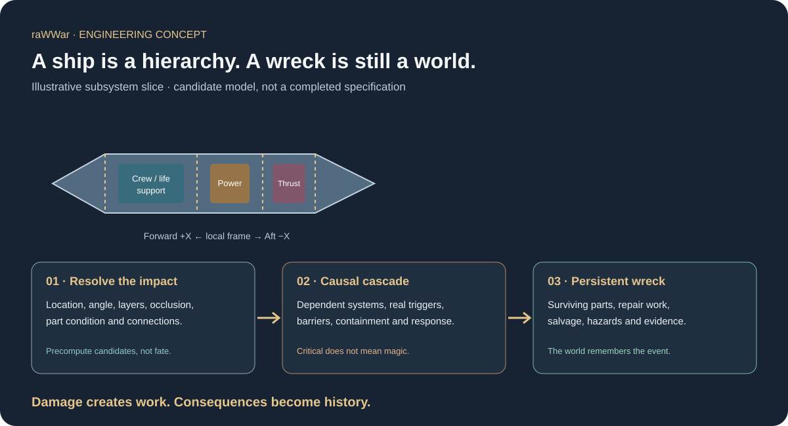

# Starship Sizing, Directional Damage, and Persistent Wrecks

**Status: candidate engineering contract and illustrative reference model.** The example is a starting point for simulation work, not a canon ship specification or real-world spacecraft design.



*The picture explains the data model, not a completed ship design. The current Wayfarer record is an initial subsystem slice; its mass budget is not yet reconciled against a complete parts inventory.*

## Can we size a ship yet?

**We can establish a reference envelope and decompose it into parts now. We cannot honestly call the ship fully sized yet.** The initial Wayfarer Systems Testbed record provides an illustrative 120 m × 34 m × 28 m envelope, a mass budget, four structural zones, and independently identifiable example parts for sensors, command, life support, power generation/distribution, thermal control, propulsion, feeds, and structure.

The missing work is explicit, not hidden: a complete mass roll-up; center-of-mass and inertia estimates; structural load paths; pressure boundaries; thermal rejection; power generation and peak/essential loads; propellant capacity and plumbing; crew volume and evacuation; access envelopes; shielding; and the full parts/connection inventory. The reference dimensions and masses are placeholders for gameplay-model development, not engineering validation.

## Why parts are first-class world assets

A vehicle should be a hierarchy, not a single hit-point pool:

```text
Ship
 ├─ Structural zones and load paths
 ├─ Compartments and pressure/fire boundaries
 ├─ Installed parts and subassemblies
 │   ├─ mounts and physical connections
 │   ├─ power, data, fluid and thermal connections
 │   ├─ dependencies and isolation boundaries
 │   └─ condition, maintenance and provenance
 ├─ Crew spaces and access routes
 └─ stores, propellant, payloads and hazards
```

Every consequential part has a stable identity, physical location, mass, parent mount, dependencies, failure modes, repair method, and salvage class. A damaged part can be isolated, disabled, detached, recovered, repaired, replaced, or accepted as salvage. Its identity and event history survive changes to the larger assembly.

## Six-direction impact model

Incoming events are evaluated in the target's local coordinate frame: forward, aft, port, starboard, dorsal (top), and ventral (bottom). The frame rotates with the target. For a specific configuration, precompute candidate surface regions, protection layers, structural layers, occlusion, weak points, service openings, and neighboring part connections.

At runtime, a hit resolves against the actual current location and incidence. A weak point is not a magic damage multiplier: a motor mount can be exposed, carry a structural load, and connect the thruster to the ship. A hit may deform the mount but leave the thruster functional for a while; thrust, vibration, or later maneuvering can turn that initial fault into a more serious failure.

Precomputation should accelerate candidate lookup and effect transfer, **not predetermine one universal explosion**. The same location may behave differently when the ship is rotated, a panel is open, a part is already cracked, the system is under load, or a nearby isolation boundary is intact.

## Cascades must have causes

A cascade is an ordered sequence of world events. Each secondary event records its trigger, transfer path, affected parts, source of energy/material/load, onset, termination or containment condition, and resulting work items.

Examples include a damaged feeder causing loss of a dependent system; a ruptured line releasing its contents; a fire spreading through a connected compartment; a damaged mount worsening under thrust; or structural collapse detaching equipment. A reactor does not automatically explode because its record is marked critical. A hazard requires an actual mechanism, state, and available source.

```text
Impact / initiating fault
        ↓
Local part condition changes
        ↓
Connected systems and barriers are evaluated
        ↓
Secondary event only if its trigger conditions exist
        ↓
Damage control, isolation, or continued propagation
        ↓
Persistent work, casualties, debris, repair, salvage, history
```

When the world is too busy to resolve every local effect immediately, deferred work must remain queued and identifiable. Optimization may defer detail; it must not erase consequences.

## The wreck remains

Destroying the parent ship does not imply that every component has been destroyed. Each part's fate depends on local exposure, protection, structural support after the event, heat and pressure history, secondary events, and subsequent handling. Possible outcomes include functional survival, degraded survival, repairability, recoverable material, scrap, consumption/dispersal, or uncertainty awaiting inspection.

A salvage lot records where it came from, what part it came from, observed condition, confidence, hazards, custody, eligible uses, and required inspection. A recovered reactor-control unit may be valuable but not accepted for use until it passes inspection and tests. A twisted mount may be useful as scrap or evidence without being a repairable assembly.

This is also a narrative system: a wreck can preserve enemy design clues, prove how a failure happened, create a dangerous recovery task, or provide a rare replacement component. The history is not a menu notification; it is evidence about a world event.

## Performance strategy

- **Authoring/build time:** calculate geometry, directional candidate regions, part adjacency, shielding/occlusion and transfer neighborhoods per approved configuration.
- **Event time:** query candidates for the actual impact, then update only the affected parts, connections, compartments and hazards.
- **Persistence:** save authoritative event records and part state. Precomputed tables are caches, never the source of truth.
- **Determinism:** key any authored variation to the event identity and world seed, not frame order or a mutable global random stream.
- **Fidelity tiers:** strategic resolution tracks zones and durable consequences; tactical resolution resolves part-level effects; inspection resolution exposes individual condition, debris and salvage evidence.

## Next engineering data to add

1. Complete the Wayfarer part inventory and reconcile every part against the mass budget.
2. Add reusable material, armor-stack, joint, cable, pipe, tank, pressure-boundary, and mount definitions.
3. Define system topology: power feeders, data routes, coolant loops, propellant lines, ventilation, pressure zones, and isolation valves.
4. Add configuration-specific hull geometry and six-face surface regions, including occlusion and service access.
5. Add test scenarios that compare exposed mount hits, protected compartment hits, severed feeder faults, contained fires, and recoverable wrecks.
6. Add persistent wreck/debris/salvage work items to the same authoritative world-history and kanban model used elsewhere in raWWar.

The principle is simple: **damage creates work; work creates decisions; decisions create consequences; consequences become history.**
